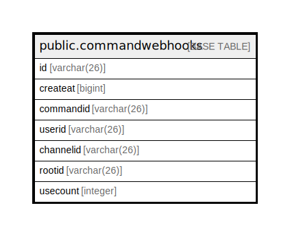

# public.commandwebhooks

## 概要

## カラム一覧

| 名前        | タイプ         | デフォルト値       | NULL許可   | 子テーブル      | 親テーブル      | コメント     |
| --------- | ----------- | ------------ | -------- | ---------- | ---------- | -------- |
| id        | varchar(26) |              | false    |            |            |          |
| createat  | bigint      |              | true     |            |            |          |
| commandid | varchar(26) |              | true     |            |            |          |
| userid    | varchar(26) |              | true     |            |            |          |
| channelid | varchar(26) |              | true     |            |            |          |
| rootid    | varchar(26) |              | true     |            |            |          |
| usecount  | integer     |              | true     |            |            |          |

## 制約一覧

| 名前                   | タイプ         | 定義               |
| -------------------- | ----------- | ---------------- |
| commandwebhooks_pkey | PRIMARY KEY | PRIMARY KEY (id) |

## INDEX一覧

| 名前                            | 定義                                                                                          |
| ----------------------------- | ------------------------------------------------------------------------------------------- |
| commandwebhooks_pkey          | CREATE UNIQUE INDEX commandwebhooks_pkey ON public.commandwebhooks USING btree (id)         |
| idx_command_webhook_create_at | CREATE INDEX idx_command_webhook_create_at ON public.commandwebhooks USING btree (createat) |

## ER図

---

> Generated by [tbls](https://github.com/k1LoW/tbls)
