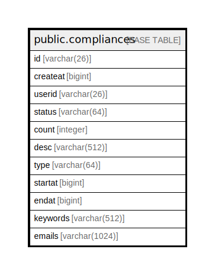

# public.compliances

## 概要

## カラム一覧

| 名前       | タイプ           | デフォルト値       | NULL許可   | 子テーブル      | 親テーブル      | コメント     |
| -------- | ------------- | ------------ | -------- | ---------- | ---------- | -------- |
| id       | varchar(26)   |              | false    |            |            |          |
| createat | bigint        |              | true     |            |            |          |
| userid   | varchar(26)   |              | true     |            |            |          |
| status   | varchar(64)   |              | true     |            |            |          |
| count    | integer       |              | true     |            |            |          |
| desc     | varchar(512)  |              | true     |            |            |          |
| type     | varchar(64)   |              | true     |            |            |          |
| startat  | bigint        |              | true     |            |            |          |
| endat    | bigint        |              | true     |            |            |          |
| keywords | varchar(512)  |              | true     |            |            |          |
| emails   | varchar(1024) |              | true     |            |            |          |

## 制約一覧

| 名前               | タイプ         | 定義               |
| ---------------- | ----------- | ---------------- |
| compliances_pkey | PRIMARY KEY | PRIMARY KEY (id) |

## INDEX一覧

| 名前               | 定義                                                                          |
| ---------------- | --------------------------------------------------------------------------- |
| compliances_pkey | CREATE UNIQUE INDEX compliances_pkey ON public.compliances USING btree (id) |

## ER図

---

> Generated by [tbls](https://github.com/k1LoW/tbls)
