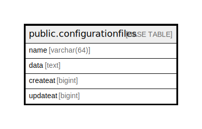

# public.configurationfiles

## 概要

## カラム一覧

| 名前       | タイプ         | デフォルト値       | NULL許可   | 子テーブル      | 親テーブル      | コメント     |
| -------- | ----------- | ------------ | -------- | ---------- | ---------- | -------- |
| name     | varchar(64) |              | false    |            |            |          |
| data     | text        |              | false    |            |            |          |
| createat | bigint      |              | false    |            |            |          |
| updateat | bigint      |              | false    |            |            |          |

## 制約一覧

| 名前                      | タイプ         | 定義                 |
| ----------------------- | ----------- | ------------------ |
| configurationfiles_pkey | PRIMARY KEY | PRIMARY KEY (name) |

## INDEX一覧

| 名前                      | 定義                                                                                          |
| ----------------------- | ------------------------------------------------------------------------------------------- |
| configurationfiles_pkey | CREATE UNIQUE INDEX configurationfiles_pkey ON public.configurationfiles USING btree (name) |

## ER図

---

> Generated by [tbls](https://github.com/k1LoW/tbls)
