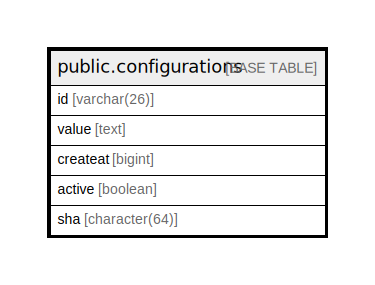

# public.configurations

## 概要

## カラム一覧

| 名前       | タイプ           | デフォルト値       | NULL許可   | 子テーブル      | 親テーブル      | コメント     |
| -------- | ------------- | ------------ | -------- | ---------- | ---------- | -------- |
| id       | varchar(26)   |              | false    |            |            |          |
| value    | text          |              | false    |            |            |          |
| createat | bigint        |              | false    |            |            |          |
| active   | boolean       |              | true     |            |            |          |
| sha      | character(64) | ''::bpchar   | true     |            |            |          |

## 制約一覧

| 名前                        | タイプ         | 定義               |
| ------------------------- | ----------- | ---------------- |
| configurations_pkey       | PRIMARY KEY | PRIMARY KEY (id) |
| configurations_active_key | UNIQUE      | UNIQUE (active)  |

## INDEX一覧

| 名前                        | 定義                                                                                          |
| ------------------------- | ------------------------------------------------------------------------------------------- |
| configurations_pkey       | CREATE UNIQUE INDEX configurations_pkey ON public.configurations USING btree (id)           |
| configurations_active_key | CREATE UNIQUE INDEX configurations_active_key ON public.configurations USING btree (active) |

## ER図

---

> Generated by [tbls](https://github.com/k1LoW/tbls)
