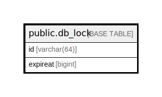

# public.db_lock

## 概要

## カラム一覧

| 名前       | タイプ         | デフォルト値       | NULL許可   | 子テーブル      | 親テーブル      | コメント     |
| -------- | ----------- | ------------ | -------- | ---------- | ---------- | -------- |
| id       | varchar(64) |              | false    |            |            |          |
| expireat | bigint      |              | true     |            |            |          |

## 制約一覧

| 名前           | タイプ         | 定義               |
| ------------ | ----------- | ---------------- |
| db_lock_pkey | PRIMARY KEY | PRIMARY KEY (id) |

## INDEX一覧

| 名前           | 定義                                                                  |
| ------------ | ------------------------------------------------------------------- |
| db_lock_pkey | CREATE UNIQUE INDEX db_lock_pkey ON public.db_lock USING btree (id) |

## ER図

---

> Generated by [tbls](https://github.com/k1LoW/tbls)
