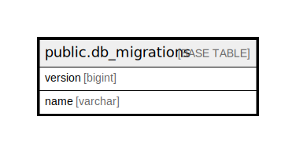

# public.db_migrations

## 概要

## カラム一覧

| 名前      | タイプ     | デフォルト値       | NULL許可   | 子テーブル      | 親テーブル      | コメント     |
| ------- | ------- | ------------ | -------- | ---------- | ---------- | -------- |
| version | bigint  |              | false    |            |            |          |
| name    | varchar |              | false    |            |            |          |

## 制約一覧

| 名前                 | タイプ         | 定義                    |
| ------------------ | ----------- | --------------------- |
| db_migrations_pkey | PRIMARY KEY | PRIMARY KEY (version) |

## INDEX一覧

| 名前                 | 定義                                                                                   |
| ------------------ | ------------------------------------------------------------------------------------ |
| db_migrations_pkey | CREATE UNIQUE INDEX db_migrations_pkey ON public.db_migrations USING btree (version) |

## ER図

---

> Generated by [tbls](https://github.com/k1LoW/tbls)
