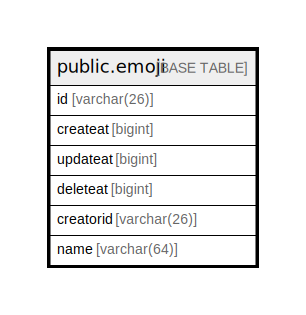

# public.emoji

## 概要

## カラム一覧

| 名前        | タイプ         | デフォルト値       | NULL許可   | 子テーブル      | 親テーブル      | コメント     |
| --------- | ----------- | ------------ | -------- | ---------- | ---------- | -------- |
| id        | varchar(26) |              | false    |            |            |          |
| createat  | bigint      |              | true     |            |            |          |
| updateat  | bigint      |              | true     |            |            |          |
| deleteat  | bigint      |              | true     |            |            |          |
| creatorid | varchar(26) |              | true     |            |            |          |
| name      | varchar(64) |              | true     |            |            |          |

## 制約一覧

| 名前                      | タイプ         | 定義                      |
| ----------------------- | ----------- | ----------------------- |
| emoji_pkey              | PRIMARY KEY | PRIMARY KEY (id)        |
| emoji_name_deleteat_key | UNIQUE      | UNIQUE (name, deleteat) |

## INDEX一覧

| 名前                      | 定義                                                                                       |
| ----------------------- | ---------------------------------------------------------------------------------------- |
| emoji_pkey              | CREATE UNIQUE INDEX emoji_pkey ON public.emoji USING btree (id)                          |
| emoji_name_deleteat_key | CREATE UNIQUE INDEX emoji_name_deleteat_key ON public.emoji USING btree (name, deleteat) |
| idx_emoji_update_at     | CREATE INDEX idx_emoji_update_at ON public.emoji USING btree (updateat)                  |
| idx_emoji_create_at     | CREATE INDEX idx_emoji_create_at ON public.emoji USING btree (createat)                  |
| idx_emoji_delete_at     | CREATE INDEX idx_emoji_delete_at ON public.emoji USING btree (deleteat)                  |

## ER図

---

> Generated by [tbls](https://github.com/k1LoW/tbls)
