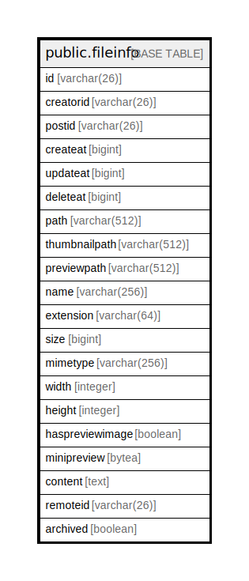

# public.fileinfo

## 概要

## カラム一覧

| 名前              | タイプ          | デフォルト値       | NULL許可   | 子テーブル      | 親テーブル      | コメント     |
| --------------- | ------------ | ------------ | -------- | ---------- | ---------- | -------- |
| id              | varchar(26)  |              | false    |            |            |          |
| creatorid       | varchar(26)  |              | true     |            |            |          |
| postid          | varchar(26)  |              | true     |            |            |          |
| createat        | bigint       |              | true     |            |            |          |
| updateat        | bigint       |              | true     |            |            |          |
| deleteat        | bigint       |              | true     |            |            |          |
| path            | varchar(512) |              | true     |            |            |          |
| thumbnailpath   | varchar(512) |              | true     |            |            |          |
| previewpath     | varchar(512) |              | true     |            |            |          |
| name            | varchar(256) |              | true     |            |            |          |
| extension       | varchar(64)  |              | true     |            |            |          |
| size            | bigint       |              | true     |            |            |          |
| mimetype        | varchar(256) |              | true     |            |            |          |
| width           | integer      |              | true     |            |            |          |
| height          | integer      |              | true     |            |            |          |
| haspreviewimage | boolean      |              | true     |            |            |          |
| minipreview     | bytea        |              | true     |            |            |          |
| content         | text         |              | true     |            |            |          |
| remoteid        | varchar(26)  |              | true     |            |            |          |
| archived        | boolean      | false        | false    |            |            |          |

## 制約一覧

| 名前            | タイプ         | 定義               |
| ------------- | ----------- | ---------------- |
| fileinfo_pkey | PRIMARY KEY | PRIMARY KEY (id) |

## INDEX一覧

| 名前                         | 定義                                                                                                                                                          |
| -------------------------- | ----------------------------------------------------------------------------------------------------------------------------------------------------------- |
| fileinfo_pkey              | CREATE UNIQUE INDEX fileinfo_pkey ON public.fileinfo USING btree (id)                                                                                       |
| idx_fileinfo_update_at     | CREATE INDEX idx_fileinfo_update_at ON public.fileinfo USING btree (updateat)                                                                               |
| idx_fileinfo_create_at     | CREATE INDEX idx_fileinfo_create_at ON public.fileinfo USING btree (createat)                                                                               |
| idx_fileinfo_delete_at     | CREATE INDEX idx_fileinfo_delete_at ON public.fileinfo USING btree (deleteat)                                                                               |
| idx_fileinfo_postid_at     | CREATE INDEX idx_fileinfo_postid_at ON public.fileinfo USING btree (postid)                                                                                 |
| idx_fileinfo_extension_at  | CREATE INDEX idx_fileinfo_extension_at ON public.fileinfo USING btree (extension)                                                                           |
| idx_fileinfo_name_txt      | CREATE INDEX idx_fileinfo_name_txt ON public.fileinfo USING gin (to_tsvector('english'::regconfig, (name)::text))                                           |
| idx_fileinfo_content_txt   | CREATE INDEX idx_fileinfo_content_txt ON public.fileinfo USING gin (to_tsvector('english'::regconfig, content))                                             |
| idx_fileinfo_name_splitted | CREATE INDEX idx_fileinfo_name_splitted ON public.fileinfo USING gin (to_tsvector('english'::regconfig, translate((name)::text, '.,-'::text, '   '::text))) |

## ER図

---

> Generated by [tbls](https://github.com/k1LoW/tbls)
