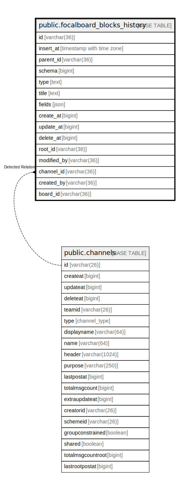

# public.focalboard_blocks_history

## 概要

## カラム一覧

| 名前          | タイプ                      | デフォルト値       | NULL許可   | 子テーブル      | 親テーブル                                 | コメント     |
| ----------- | ------------------------ | ------------ | -------- | ---------- | ------------------------------------- | -------- |
| id          | varchar(36)              |              | false    |            |                                       |          |
| insert_at   | timestamp with time zone | now()        | false    |            |                                       |          |
| parent_id   | varchar(36)              |              | true     |            |                                       |          |
| schema      | bigint                   |              | true     |            |                                       |          |
| type        | text                     |              | true     |            |                                       |          |
| title       | text                     |              | true     |            |                                       |          |
| fields      | json                     |              | true     |            |                                       |          |
| create_at   | bigint                   |              | true     |            |                                       |          |
| update_at   | bigint                   |              | true     |            |                                       |          |
| delete_at   | bigint                   |              | true     |            |                                       |          |
| root_id     | varchar(36)              |              | true     |            |                                       |          |
| modified_by | varchar(36)              |              | true     |            |                                       |          |
| channel_id  | varchar(36)              |              | true     |            | [public.channels](public.channels.md) |          |
| created_by  | varchar(36)              |              | true     |            |                                       |          |
| board_id    | varchar(36)              |              | true     |            |                                       |          |

## 制約一覧

| 名前                     | タイプ         | 定義                          |
| ---------------------- | ----------- | --------------------------- |
| focalboard_blocks_pkey | PRIMARY KEY | PRIMARY KEY (id, insert_at) |

## INDEX一覧

| 名前                     | 定義                                                                                                         |
| ---------------------- | ---------------------------------------------------------------------------------------------------------- |
| focalboard_blocks_pkey | CREATE UNIQUE INDEX focalboard_blocks_pkey ON public.focalboard_blocks_history USING btree (id, insert_at) |

## ER図

---

> Generated by [tbls](https://github.com/k1LoW/tbls)
