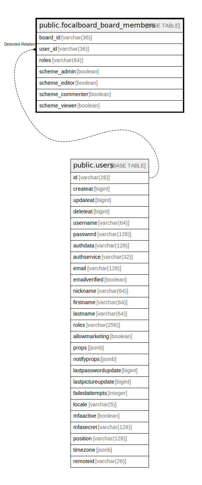

# public.focalboard_board_members

## 概要

## カラム一覧

| 名前               | タイプ         | デフォルト値       | NULL許可   | 子テーブル      | 親テーブル                           | コメント     |
| ---------------- | ----------- | ------------ | -------- | ---------- | ------------------------------- | -------- |
| board_id         | varchar(36) |              | false    |            |                                 |          |
| user_id          | varchar(36) |              | false    |            | [public.users](public.users.md) |          |
| roles            | varchar(64) |              | true     |            |                                 |          |
| scheme_admin     | boolean     |              | true     |            |                                 |          |
| scheme_editor    | boolean     |              | true     |            |                                 |          |
| scheme_commenter | boolean     |              | true     |            |                                 |          |
| scheme_viewer    | boolean     |              | true     |            |                                 |          |

## 制約一覧

| 名前                            | タイプ         | 定義                              |
| ----------------------------- | ----------- | ------------------------------- |
| focalboard_board_members_pkey | PRIMARY KEY | PRIMARY KEY (board_id, user_id) |

## INDEX一覧

| 名前                            | 定義                                                                                                                   |
| ----------------------------- | -------------------------------------------------------------------------------------------------------------------- |
| focalboard_board_members_pkey | CREATE UNIQUE INDEX focalboard_board_members_pkey ON public.focalboard_board_members USING btree (board_id, user_id) |
| idx_boardmembers_user_id      | CREATE INDEX idx_boardmembers_user_id ON public.focalboard_board_members USING btree (user_id)                       |

## ER図

---

> Generated by [tbls](https://github.com/k1LoW/tbls)
