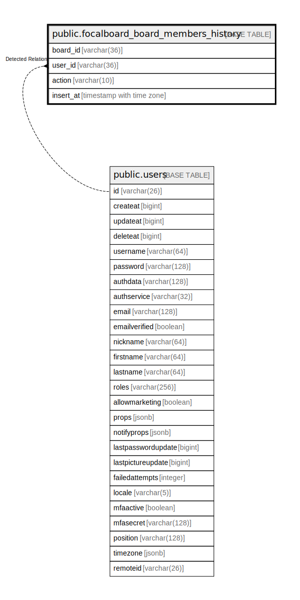

# public.focalboard_board_members_history

## 概要

## カラム一覧

| 名前        | タイプ                      | デフォルト値       | NULL許可   | 子テーブル      | 親テーブル                           | コメント     |
| --------- | ------------------------ | ------------ | -------- | ---------- | ------------------------------- | -------- |
| board_id  | varchar(36)              |              | false    |            |                                 |          |
| user_id   | varchar(36)              |              | false    |            | [public.users](public.users.md) |          |
| action    | varchar(10)              |              | true     |            |                                 |          |
| insert_at | timestamp with time zone | now()        | false    |            |                                 |          |

## 制約一覧

| 名前                                    | タイプ         | 定義                                         |
| ------------------------------------- | ----------- | ------------------------------------------ |
| focalboard_board_members_history_pkey | PRIMARY KEY | PRIMARY KEY (board_id, user_id, insert_at) |

## INDEX一覧

| 名前                                       | 定義                                                                                                                                              |
| ---------------------------------------- | ----------------------------------------------------------------------------------------------------------------------------------------------- |
| focalboard_board_members_history_pkey    | CREATE UNIQUE INDEX focalboard_board_members_history_pkey ON public.focalboard_board_members_history USING btree (board_id, user_id, insert_at) |
| idx_boardmembershistory_user_id          | CREATE INDEX idx_boardmembershistory_user_id ON public.focalboard_board_members_history USING btree (user_id)                                   |
| idx_boardmembershistory_board_id_user_id | CREATE INDEX idx_boardmembershistory_board_id_user_id ON public.focalboard_board_members_history USING btree (board_id, user_id)                |

## ER図

---

> Generated by [tbls](https://github.com/k1LoW/tbls)
