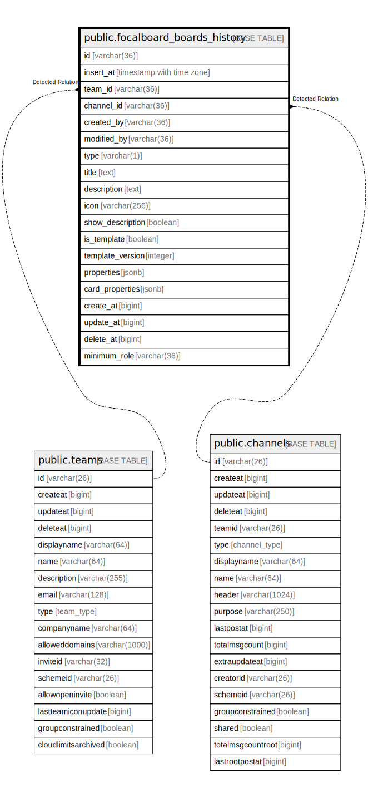

# public.focalboard_boards_history

## 概要

## カラム一覧

| 名前               | タイプ                      | デフォルト値                | NULL許可   | 子テーブル      | 親テーブル                                 | コメント     |
| ---------------- | ------------------------ | --------------------- | -------- | ---------- | ------------------------------------- | -------- |
| id               | varchar(36)              |                       | false    |            |                                       |          |
| insert_at        | timestamp with time zone | now()                 | false    |            |                                       |          |
| team_id          | varchar(36)              |                       | false    |            | [public.teams](public.teams.md)       |          |
| channel_id       | varchar(36)              |                       | true     |            | [public.channels](public.channels.md) |          |
| created_by       | varchar(36)              |                       | true     |            |                                       |          |
| modified_by      | varchar(36)              |                       | true     |            |                                       |          |
| type             | varchar(1)               |                       | false    |            |                                       |          |
| title            | text                     |                       | false    |            |                                       |          |
| description      | text                     |                       | true     |            |                                       |          |
| icon             | varchar(256)             |                       | true     |            |                                       |          |
| show_description | boolean                  |                       | true     |            |                                       |          |
| is_template      | boolean                  |                       | true     |            |                                       |          |
| template_version | integer                  | 0                     | true     |            |                                       |          |
| properties       | jsonb                    |                       | true     |            |                                       |          |
| card_properties  | jsonb                    |                       | true     |            |                                       |          |
| create_at        | bigint                   |                       | true     |            |                                       |          |
| update_at        | bigint                   |                       | true     |            |                                       |          |
| delete_at        | bigint                   |                       | true     |            |                                       |          |
| minimum_role     | varchar(36)              | ''::character varying | false    |            |                                       |          |

## 制約一覧

| 名前                             | タイプ         | 定義                          |
| ------------------------------ | ----------- | --------------------------- |
| focalboard_boards_history_pkey | PRIMARY KEY | PRIMARY KEY (id, insert_at) |

## INDEX一覧

| 名前                             | 定義                                                                                                                 |
| ------------------------------ | ------------------------------------------------------------------------------------------------------------------ |
| focalboard_boards_history_pkey | CREATE UNIQUE INDEX focalboard_boards_history_pkey ON public.focalboard_boards_history USING btree (id, insert_at) |

## ER図

---

> Generated by [tbls](https://github.com/k1LoW/tbls)
