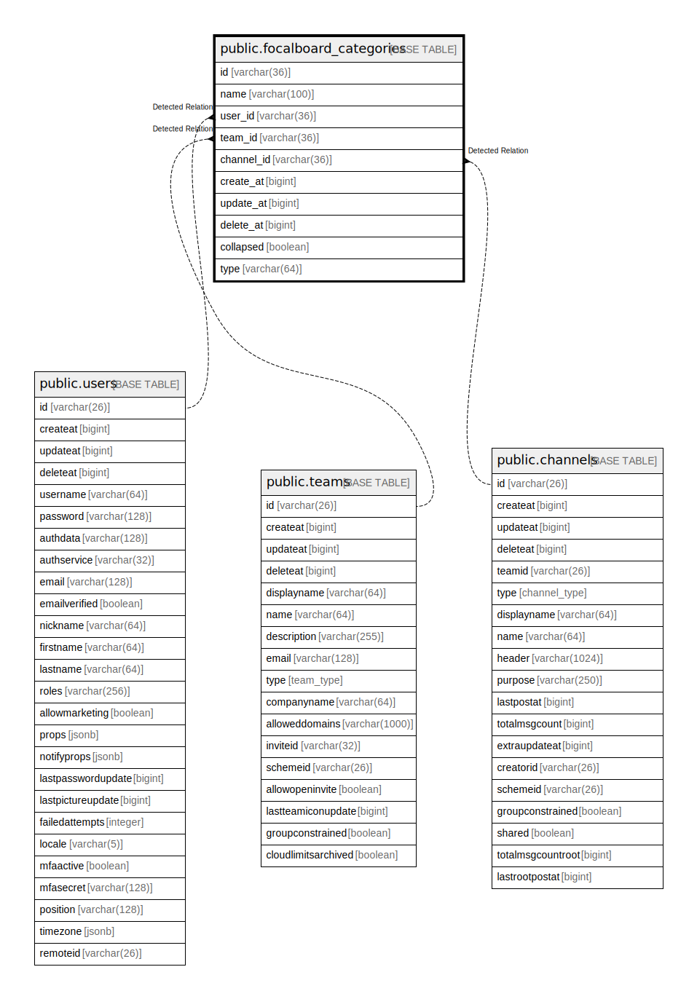

# public.focalboard_categories

## 概要

## カラム一覧

| 名前         | タイプ          | デフォルト値       | NULL許可   | 子テーブル      | 親テーブル                                 | コメント     |
| ---------- | ------------ | ------------ | -------- | ---------- | ------------------------------------- | -------- |
| id         | varchar(36)  |              | false    |            |                                       |          |
| name       | varchar(100) |              | false    |            |                                       |          |
| user_id    | varchar(36)  |              | false    |            | [public.users](public.users.md)       |          |
| team_id    | varchar(36)  |              | false    |            | [public.teams](public.teams.md)       |          |
| channel_id | varchar(36)  |              | true     |            | [public.channels](public.channels.md) |          |
| create_at  | bigint       |              | true     |            |                                       |          |
| update_at  | bigint       |              | true     |            |                                       |          |
| delete_at  | bigint       |              | true     |            |                                       |          |
| collapsed  | boolean      | false        | true     |            |                                       |          |
| type       | varchar(64)  |              | true     |            |                                       |          |

## 制約一覧

| 名前                         | タイプ         | 定義               |
| -------------------------- | ----------- | ---------------- |
| focalboard_categories_pkey | PRIMARY KEY | PRIMARY KEY (id) |

## INDEX一覧

| 名前                             | 定義                                                                                                         |
| ------------------------------ | ---------------------------------------------------------------------------------------------------------- |
| focalboard_categories_pkey     | CREATE UNIQUE INDEX focalboard_categories_pkey ON public.focalboard_categories USING btree (id)            |
| idx_categories_user_id_team_id | CREATE INDEX idx_categories_user_id_team_id ON public.focalboard_categories USING btree (user_id, team_id) |

## ER図

---

> Generated by [tbls](https://github.com/k1LoW/tbls)
