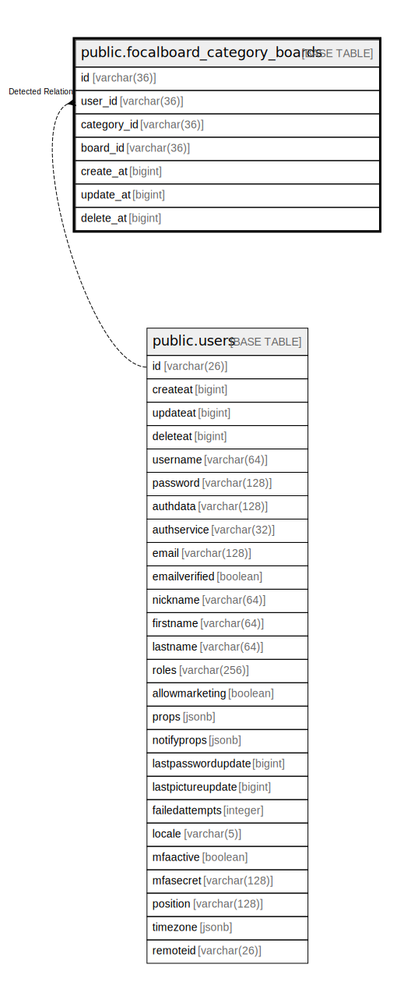

# public.focalboard_category_boards

## 概要

## カラム一覧

| 名前          | タイプ         | デフォルト値       | NULL許可   | 子テーブル      | 親テーブル                           | コメント     |
| ----------- | ----------- | ------------ | -------- | ---------- | ------------------------------- | -------- |
| id          | varchar(36) |              | false    |            |                                 |          |
| user_id     | varchar(36) |              | false    |            | [public.users](public.users.md) |          |
| category_id | varchar(36) |              | false    |            |                                 |          |
| board_id    | varchar(36) |              | false    |            |                                 |          |
| create_at   | bigint      |              | true     |            |                                 |          |
| update_at   | bigint      |              | true     |            |                                 |          |
| delete_at   | bigint      |              | true     |            |                                 |          |

## 制約一覧

| 名前                              | タイプ         | 定義               |
| ------------------------------- | ----------- | ---------------- |
| focalboard_category_boards_pkey | PRIMARY KEY | PRIMARY KEY (id) |

## INDEX一覧

| 名前                              | 定義                                                                                                         |
| ------------------------------- | ---------------------------------------------------------------------------------------------------------- |
| focalboard_category_boards_pkey | CREATE UNIQUE INDEX focalboard_category_boards_pkey ON public.focalboard_category_boards USING btree (id)  |
| idx_categoryboards_category_id  | CREATE INDEX idx_categoryboards_category_id ON public.focalboard_category_boards USING btree (category_id) |

## ER図

---

> Generated by [tbls](https://github.com/k1LoW/tbls)
