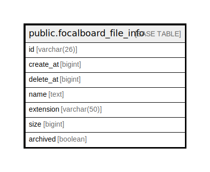

# public.focalboard_file_info

## 概要

## カラム一覧

| 名前        | タイプ         | デフォルト値       | NULL許可   | 子テーブル      | 親テーブル      | コメント     |
| --------- | ----------- | ------------ | -------- | ---------- | ---------- | -------- |
| id        | varchar(26) |              | false    |            |            |          |
| create_at | bigint      |              | false    |            |            |          |
| delete_at | bigint      |              | true     |            |            |          |
| name      | text        |              | false    |            |            |          |
| extension | varchar(50) |              | false    |            |            |          |
| size      | bigint      |              | false    |            |            |          |
| archived  | boolean     |              | true     |            |            |          |

## ER図

---

> Generated by [tbls](https://github.com/k1LoW/tbls)
