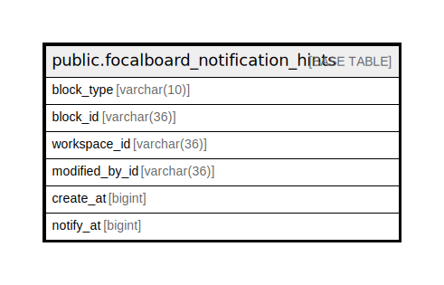

# public.focalboard_notification_hints

## 概要

## カラム一覧

| 名前             | タイプ         | デフォルト値       | NULL許可   | 子テーブル      | 親テーブル      | コメント     |
| -------------- | ----------- | ------------ | -------- | ---------- | ---------- | -------- |
| block_type     | varchar(10) |              | true     |            |            |          |
| block_id       | varchar(36) |              | false    |            |            |          |
| workspace_id   | varchar(36) |              | true     |            |            |          |
| modified_by_id | varchar(36) |              | true     |            |            |          |
| create_at      | bigint      |              | true     |            |            |          |
| notify_at      | bigint      |              | true     |            |            |          |

## 制約一覧

| 名前                                 | タイプ         | 定義                     |
| ---------------------------------- | ----------- | ---------------------- |
| focalboard_notification_hints_pkey | PRIMARY KEY | PRIMARY KEY (block_id) |

## INDEX一覧

| 名前                                 | 定義                                                                                                                    |
| ---------------------------------- | --------------------------------------------------------------------------------------------------------------------- |
| focalboard_notification_hints_pkey | CREATE UNIQUE INDEX focalboard_notification_hints_pkey ON public.focalboard_notification_hints USING btree (block_id) |

## ER図

---

> Generated by [tbls](https://github.com/k1LoW/tbls)
