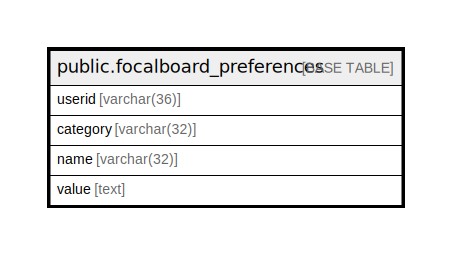

# public.focalboard_preferences

## 概要

## カラム一覧

| 名前       | タイプ         | デフォルト値       | NULL許可   | 子テーブル      | 親テーブル      | コメント     |
| -------- | ----------- | ------------ | -------- | ---------- | ---------- | -------- |
| userid   | varchar(36) |              | false    |            |            |          |
| category | varchar(32) |              | false    |            |            |          |
| name     | varchar(32) |              | false    |            |            |          |
| value    | text        |              | true     |            |            |          |

## 制約一覧

| 名前                          | タイプ         | 定義                                   |
| --------------------------- | ----------- | ------------------------------------ |
| focalboard_preferences_pkey | PRIMARY KEY | PRIMARY KEY (userid, category, name) |

## INDEX一覧

| 名前                                  | 定義                                                                                                                    |
| ----------------------------------- | --------------------------------------------------------------------------------------------------------------------- |
| focalboard_preferences_pkey         | CREATE UNIQUE INDEX focalboard_preferences_pkey ON public.focalboard_preferences USING btree (userid, category, name) |
| idx_focalboard_preferences_category | CREATE INDEX idx_focalboard_preferences_category ON public.focalboard_preferences USING btree (category)              |
| idx_focalboard_preferences_name     | CREATE INDEX idx_focalboard_preferences_name ON public.focalboard_preferences USING btree (name)                      |

## ER図

---

> Generated by [tbls](https://github.com/k1LoW/tbls)
