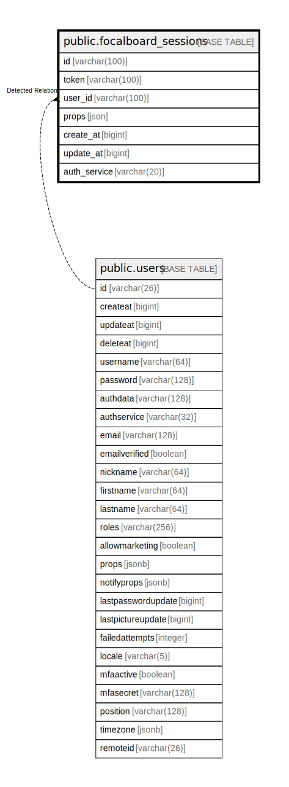

# public.focalboard_sessions

## 概要

## カラム一覧

| 名前           | タイプ          | デフォルト値       | NULL許可   | 子テーブル      | 親テーブル                           | コメント     |
| ------------ | ------------ | ------------ | -------- | ---------- | ------------------------------- | -------- |
| id           | varchar(100) |              | false    |            |                                 |          |
| token        | varchar(100) |              | true     |            |                                 |          |
| user_id      | varchar(100) |              | true     |            | [public.users](public.users.md) |          |
| props        | json         |              | true     |            |                                 |          |
| create_at    | bigint       |              | true     |            |                                 |          |
| update_at    | bigint       |              | true     |            |                                 |          |
| auth_service | varchar(20)  |              | true     |            |                                 |          |

## 制約一覧

| 名前                       | タイプ         | 定義               |
| ------------------------ | ----------- | ---------------- |
| focalboard_sessions_pkey | PRIMARY KEY | PRIMARY KEY (id) |

## INDEX一覧

| 名前                       | 定義                                                                                          |
| ------------------------ | ------------------------------------------------------------------------------------------- |
| focalboard_sessions_pkey | CREATE UNIQUE INDEX focalboard_sessions_pkey ON public.focalboard_sessions USING btree (id) |

## ER図

---

> Generated by [tbls](https://github.com/k1LoW/tbls)
