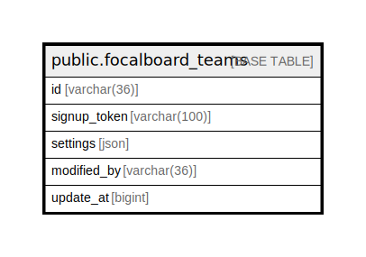

# public.focalboard_teams

## 概要

## カラム一覧

| 名前           | タイプ          | デフォルト値       | NULL許可   | 子テーブル      | 親テーブル      | コメント     |
| ------------ | ------------ | ------------ | -------- | ---------- | ---------- | -------- |
| id           | varchar(36)  |              | false    |            |            |          |
| signup_token | varchar(100) |              | false    |            |            |          |
| settings     | json         |              | true     |            |            |          |
| modified_by  | varchar(36)  |              | true     |            |            |          |
| update_at    | bigint       |              | true     |            |            |          |

## 制約一覧

| 名前                         | タイプ         | 定義               |
| -------------------------- | ----------- | ---------------- |
| focalboard_workspaces_pkey | PRIMARY KEY | PRIMARY KEY (id) |

## INDEX一覧

| 名前                         | 定義                                                                                         |
| -------------------------- | ------------------------------------------------------------------------------------------ |
| focalboard_workspaces_pkey | CREATE UNIQUE INDEX focalboard_workspaces_pkey ON public.focalboard_teams USING btree (id) |

## ER図

---

> Generated by [tbls](https://github.com/k1LoW/tbls)
