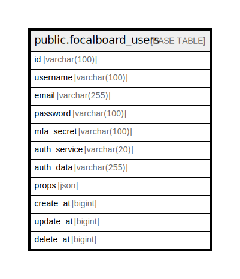

# public.focalboard_users

## 概要

## カラム一覧

| 名前           | タイプ          | デフォルト値       | NULL許可   | 子テーブル      | 親テーブル      | コメント     |
| ------------ | ------------ | ------------ | -------- | ---------- | ---------- | -------- |
| id           | varchar(100) |              | false    |            |            |          |
| username     | varchar(100) |              | true     |            |            |          |
| email        | varchar(255) |              | true     |            |            |          |
| password     | varchar(100) |              | true     |            |            |          |
| mfa_secret   | varchar(100) |              | true     |            |            |          |
| auth_service | varchar(20)  |              | true     |            |            |          |
| auth_data    | varchar(255) |              | true     |            |            |          |
| props        | json         |              | true     |            |            |          |
| create_at    | bigint       |              | true     |            |            |          |
| update_at    | bigint       |              | true     |            |            |          |
| delete_at    | bigint       |              | true     |            |            |          |

## 制約一覧

| 名前                    | タイプ         | 定義               |
| --------------------- | ----------- | ---------------- |
| focalboard_users_pkey | PRIMARY KEY | PRIMARY KEY (id) |

## INDEX一覧

| 名前                    | 定義                                                                                    |
| --------------------- | ------------------------------------------------------------------------------------- |
| focalboard_users_pkey | CREATE UNIQUE INDEX focalboard_users_pkey ON public.focalboard_users USING btree (id) |

## ER図

---

> Generated by [tbls](https://github.com/k1LoW/tbls)
