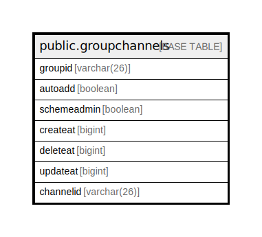

# public.groupchannels

## 概要

## カラム一覧

| 名前          | タイプ         | デフォルト値       | NULL許可   | 子テーブル      | 親テーブル      | コメント     |
| ----------- | ----------- | ------------ | -------- | ---------- | ---------- | -------- |
| groupid     | varchar(26) |              | false    |            |            |          |
| autoadd     | boolean     |              | true     |            |            |          |
| schemeadmin | boolean     |              | true     |            |            |          |
| createat    | bigint      |              | true     |            |            |          |
| deleteat    | bigint      |              | true     |            |            |          |
| updateat    | bigint      |              | true     |            |            |          |
| channelid   | varchar(26) |              | false    |            |            |          |

## 制約一覧

| 名前                 | タイプ         | 定義                               |
| ------------------ | ----------- | -------------------------------- |
| groupchannels_pkey | PRIMARY KEY | PRIMARY KEY (groupid, channelid) |

## INDEX一覧

| 名前                            | 定義                                                                                              |
| ----------------------------- | ----------------------------------------------------------------------------------------------- |
| groupchannels_pkey            | CREATE UNIQUE INDEX groupchannels_pkey ON public.groupchannels USING btree (groupid, channelid) |
| idx_groupchannels_channelid   | CREATE INDEX idx_groupchannels_channelid ON public.groupchannels USING btree (channelid)        |
| idx_groupchannels_schemeadmin | CREATE INDEX idx_groupchannels_schemeadmin ON public.groupchannels USING btree (schemeadmin)    |

## ER図

---

> Generated by [tbls](https://github.com/k1LoW/tbls)
