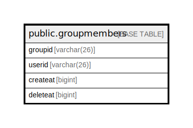

# public.groupmembers

## 概要

## カラム一覧

| 名前       | タイプ         | デフォルト値       | NULL許可   | 子テーブル      | 親テーブル      | コメント     |
| -------- | ----------- | ------------ | -------- | ---------- | ---------- | -------- |
| groupid  | varchar(26) |              | false    |            |            |          |
| userid   | varchar(26) |              | false    |            |            |          |
| createat | bigint      |              | true     |            |            |          |
| deleteat | bigint      |              | true     |            |            |          |

## 制約一覧

| 名前                | タイプ         | 定義                            |
| ----------------- | ----------- | ----------------------------- |
| groupmembers_pkey | PRIMARY KEY | PRIMARY KEY (groupid, userid) |

## INDEX一覧

| 名前                         | 定義                                                                                         |
| -------------------------- | ------------------------------------------------------------------------------------------ |
| groupmembers_pkey          | CREATE UNIQUE INDEX groupmembers_pkey ON public.groupmembers USING btree (groupid, userid) |
| idx_groupmembers_create_at | CREATE INDEX idx_groupmembers_create_at ON public.groupmembers USING btree (createat)      |

## ER図

---

> Generated by [tbls](https://github.com/k1LoW/tbls)
