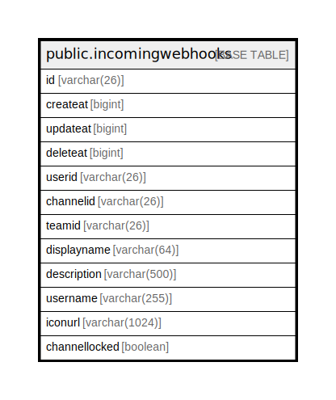

# public.incomingwebhooks

## 概要

## カラム一覧

| 名前            | タイプ           | デフォルト値       | NULL許可   | 子テーブル      | 親テーブル      | コメント     |
| ------------- | ------------- | ------------ | -------- | ---------- | ---------- | -------- |
| id            | varchar(26)   |              | false    |            |            |          |
| createat      | bigint        |              | true     |            |            |          |
| updateat      | bigint        |              | true     |            |            |          |
| deleteat      | bigint        |              | true     |            |            |          |
| userid        | varchar(26)   |              | true     |            |            |          |
| channelid     | varchar(26)   |              | true     |            |            |          |
| teamid        | varchar(26)   |              | true     |            |            |          |
| displayname   | varchar(64)   |              | true     |            |            |          |
| description   | varchar(500)  |              | true     |            |            |          |
| username      | varchar(255)  |              | true     |            |            |          |
| iconurl       | varchar(1024) |              | true     |            |            |          |
| channellocked | boolean       |              | true     |            |            |          |

## 制約一覧

| 名前                    | タイプ         | 定義               |
| --------------------- | ----------- | ---------------- |
| incomingwebhooks_pkey | PRIMARY KEY | PRIMARY KEY (id) |

## INDEX一覧

| 名前                             | 定義                                                                                            |
| ------------------------------ | --------------------------------------------------------------------------------------------- |
| incomingwebhooks_pkey          | CREATE UNIQUE INDEX incomingwebhooks_pkey ON public.incomingwebhooks USING btree (id)         |
| idx_incoming_webhook_user_id   | CREATE INDEX idx_incoming_webhook_user_id ON public.incomingwebhooks USING btree (userid)     |
| idx_incoming_webhook_team_id   | CREATE INDEX idx_incoming_webhook_team_id ON public.incomingwebhooks USING btree (teamid)     |
| idx_incoming_webhook_update_at | CREATE INDEX idx_incoming_webhook_update_at ON public.incomingwebhooks USING btree (updateat) |
| idx_incoming_webhook_create_at | CREATE INDEX idx_incoming_webhook_create_at ON public.incomingwebhooks USING btree (createat) |
| idx_incoming_webhook_delete_at | CREATE INDEX idx_incoming_webhook_delete_at ON public.incomingwebhooks USING btree (deleteat) |

## ER図

---

> Generated by [tbls](https://github.com/k1LoW/tbls)
