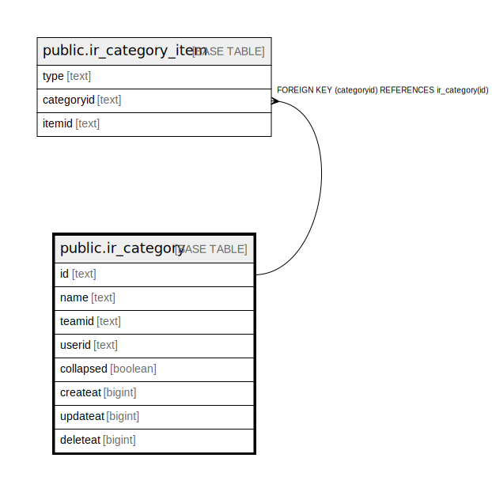

# public.ir_category

## 概要

## カラム一覧

| 名前        | タイプ     | デフォルト値       | NULL許可   | 子テーブル                                                 | 親テーブル      | コメント     |
| --------- | ------- | ------------ | -------- | ----------------------------------------------------- | ---------- | -------- |
| id        | text    |              | false    | [public.ir_category_item](public.ir_category_item.md) |            |          |
| name      | text    |              | false    |                                                       |            |          |
| teamid    | text    |              | false    |                                                       |            |          |
| userid    | text    |              | false    |                                                       |            |          |
| collapsed | boolean | false        | true     |                                                       |            |          |
| createat  | bigint  |              | false    |                                                       |            |          |
| updateat  | bigint  | 0            | false    |                                                       |            |          |
| deleteat  | bigint  | 0            | false    |                                                       |            |          |

## 制約一覧

| 名前               | タイプ         | 定義               |
| ---------------- | ----------- | ---------------- |
| ir_category_pkey | PRIMARY KEY | PRIMARY KEY (id) |

## INDEX一覧

| 名前                        | 定義                                                                                        |
| ------------------------- | ----------------------------------------------------------------------------------------- |
| ir_category_pkey          | CREATE UNIQUE INDEX ir_category_pkey ON public.ir_category USING btree (id)               |
| ir_category_teamid_userid | CREATE INDEX ir_category_teamid_userid ON public.ir_category USING btree (teamid, userid) |

## ER図

---

> Generated by [tbls](https://github.com/k1LoW/tbls)
