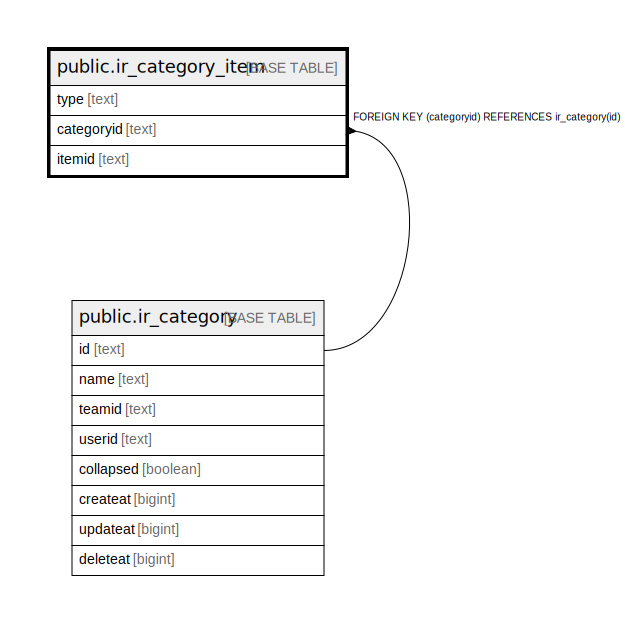

# public.ir_category_item

## 概要

## カラム一覧

| 名前         | タイプ    | デフォルト値       | NULL許可   | 子テーブル      | 親テーブル                                       | コメント     |
| ---------- | ------ | ------------ | -------- | ---------- | ------------------------------------------- | -------- |
| type       | text   |              | false    |            |                                             |          |
| categoryid | text   |              | false    |            | [public.ir_category](public.ir_category.md) |          |
| itemid     | text   |              | false    |            |                                             |          |

## 制約一覧

| 名前                               | タイプ         | 定義                                                  |
| -------------------------------- | ----------- | --------------------------------------------------- |
| ir_category_item_categoryid_fkey | FOREIGN KEY | FOREIGN KEY (categoryid) REFERENCES ir_category(id) |
| ir_category_item_pkey            | PRIMARY KEY | PRIMARY KEY (categoryid, itemid, type)              |

## INDEX一覧

| 名前                          | 定義                                                                                                          |
| --------------------------- | ----------------------------------------------------------------------------------------------------------- |
| ir_category_item_categoryid | CREATE INDEX ir_category_item_categoryid ON public.ir_category_item USING btree (categoryid)                |
| ir_category_item_pkey       | CREATE UNIQUE INDEX ir_category_item_pkey ON public.ir_category_item USING btree (categoryid, itemid, type) |

## ER図

---

> Generated by [tbls](https://github.com/k1LoW/tbls)
