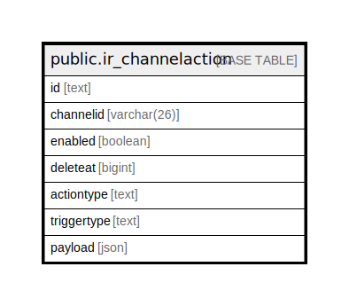

# public.ir_channelaction

## 概要

## カラム一覧

| 名前          | タイプ         | デフォルト値       | NULL許可   | 子テーブル      | 親テーブル      | コメント     |
| ----------- | ----------- | ------------ | -------- | ---------- | ---------- | -------- |
| id          | text        |              | false    |            |            |          |
| channelid   | varchar(26) |              | true     |            |            |          |
| enabled     | boolean     | false        | true     |            |            |          |
| deleteat    | bigint      | 0            | false    |            |            |          |
| actiontype  | text        |              | false    |            |            |          |
| triggertype | text        |              | false    |            |            |          |
| payload     | json        |              | false    |            |            |          |

## 制約一覧

| 名前                    | タイプ         | 定義               |
| --------------------- | ----------- | ---------------- |
| ir_channelaction_pkey | PRIMARY KEY | PRIMARY KEY (id) |

## INDEX一覧

| 名前                         | 定義                                                                                         |
| -------------------------- | ------------------------------------------------------------------------------------------ |
| ir_channelaction_pkey      | CREATE UNIQUE INDEX ir_channelaction_pkey ON public.ir_channelaction USING btree (id)      |
| ir_channelaction_channelid | CREATE INDEX ir_channelaction_channelid ON public.ir_channelaction USING btree (channelid) |

## ER図

---

> Generated by [tbls](https://github.com/k1LoW/tbls)
