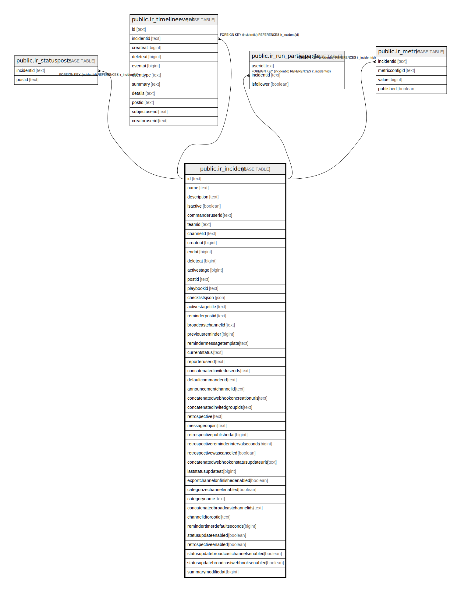

# public.ir_incident

## 概要

## カラム一覧

| 名前                                    | タイプ     | デフォルト値         | NULL許可   | 子テーブル                                                                                                                                                                                                       | 親テーブル      | コメント     |
| ------------------------------------- | ------- | -------------- | -------- | ----------------------------------------------------------------------------------------------------------------------------------------------------------------------------------------------------------- | ---------- | -------- |
| id                                    | text    |                | false    | [public.ir_statusposts](public.ir_statusposts.md) [public.ir_timelineevent](public.ir_timelineevent.md) [public.ir_run_participants](public.ir_run_participants.md) [public.ir_metric](public.ir_metric.md) |            |          |
| name                                  | text    |                | false    |                                                                                                                                                                                                             |            |          |
| description                           | text    |                | false    |                                                                                                                                                                                                             |            |          |
| isactive                              | boolean |                | false    |                                                                                                                                                                                                             |            |          |
| commanderuserid                       | text    |                | false    |                                                                                                                                                                                                             |            |          |
| teamid                                | text    |                | false    |                                                                                                                                                                                                             |            |          |
| channelid                             | text    |                | false    |                                                                                                                                                                                                             |            |          |
| createat                              | bigint  |                | false    |                                                                                                                                                                                                             |            |          |
| endat                                 | bigint  | 0              | false    |                                                                                                                                                                                                             |            |          |
| deleteat                              | bigint  | 0              | false    |                                                                                                                                                                                                             |            |          |
| activestage                           | bigint  |                | false    |                                                                                                                                                                                                             |            |          |
| postid                                | text    | ''::text       | false    |                                                                                                                                                                                                             |            |          |
| playbookid                            | text    | ''::text       | false    |                                                                                                                                                                                                             |            |          |
| checklistsjson                        | json    |                | false    |                                                                                                                                                                                                             |            |          |
| activestagetitle                      | text    | ''::text       | true     |                                                                                                                                                                                                             |            |          |
| reminderpostid                        | text    |                | true     |                                                                                                                                                                                                             |            |          |
| broadcastchannelid                    | text    | ''::text       | true     |                                                                                                                                                                                                             |            |          |
| previousreminder                      | bigint  | 0              | false    |                                                                                                                                                                                                             |            |          |
| remindermessagetemplate               | text    | ''::text       | true     |                                                                                                                                                                                                             |            |          |
| currentstatus                         | text    | 'Active'::text | false    |                                                                                                                                                                                                             |            |          |
| reporteruserid                        | text    | ''::text       | false    |                                                                                                                                                                                                             |            |          |
| concatenatedinviteduserids            | text    | ''::text       | true     |                                                                                                                                                                                                             |            |          |
| defaultcommanderid                    | text    | ''::text       | true     |                                                                                                                                                                                                             |            |          |
| announcementchannelid                 | text    | ''::text       | true     |                                                                                                                                                                                                             |            |          |
| concatenatedwebhookoncreationurls     | text    | ''::text       | true     |                                                                                                                                                                                                             |            |          |
| concatenatedinvitedgroupids           | text    | ''::text       | true     |                                                                                                                                                                                                             |            |          |
| retrospective                         | text    | ''::text       | true     |                                                                                                                                                                                                             |            |          |
| messageonjoin                         | text    | ''::text       | true     |                                                                                                                                                                                                             |            |          |
| retrospectivepublishedat              | bigint  | 0              | false    |                                                                                                                                                                                                             |            |          |
| retrospectivereminderintervalseconds  | bigint  | 0              | false    |                                                                                                                                                                                                             |            |          |
| retrospectivewascanceled              | boolean | false          | true     |                                                                                                                                                                                                             |            |          |
| concatenatedwebhookonstatusupdateurls | text    | ''::text       | true     |                                                                                                                                                                                                             |            |          |
| laststatusupdateat                    | bigint  | 0              | true     |                                                                                                                                                                                                             |            |          |
| exportchannelonfinishedenabled        | boolean | false          | false    |                                                                                                                                                                                                             |            |          |
| categorizechannelenabled              | boolean | false          | true     |                                                                                                                                                                                                             |            |          |
| categoryname                          | text    | ''::text       | true     |                                                                                                                                                                                                             |            |          |
| concatenatedbroadcastchannelids       | text    |                | true     |                                                                                                                                                                                                             |            |          |
| channelidtorootid                     | text    | ''::text       | true     |                                                                                                                                                                                                             |            |          |
| remindertimerdefaultseconds           | bigint  | 0              | false    |                                                                                                                                                                                                             |            |          |
| statusupdateenabled                   | boolean | true           | true     |                                                                                                                                                                                                             |            |          |
| retrospectiveenabled                  | boolean | true           | true     |                                                                                                                                                                                                             |            |          |
| statusupdatebroadcastchannelsenabled  | boolean | false          | true     |                                                                                                                                                                                                             |            |          |
| statusupdatebroadcastwebhooksenabled  | boolean | false          | true     |                                                                                                                                                                                                             |            |          |
| summarymodifiedat                     | bigint  | 0              | false    |                                                                                                                                                                                                             |            |          |

## 制約一覧

| 名前                        | タイプ         | 定義                 |
| ------------------------- | ----------- | ------------------ |
| ir_incident_pkey          | PRIMARY KEY | PRIMARY KEY (id)   |
| ir_incident_channelid_key | UNIQUE      | UNIQUE (channelid) |

## INDEX一覧

| 名前                                 | 定義                                                                                                          |
| ---------------------------------- | ----------------------------------------------------------------------------------------------------------- |
| ir_incident_pkey                   | CREATE UNIQUE INDEX ir_incident_pkey ON public.ir_incident USING btree (id)                                 |
| ir_incident_channelid_key          | CREATE UNIQUE INDEX ir_incident_channelid_key ON public.ir_incident USING btree (channelid)                 |
| ir_incident_teamid                 | CREATE INDEX ir_incident_teamid ON public.ir_incident USING btree (teamid)                                  |
| ir_incident_teamid_commanderuserid | CREATE INDEX ir_incident_teamid_commanderuserid ON public.ir_incident USING btree (teamid, commanderuserid) |
| ir_incident_channelid              | CREATE INDEX ir_incident_channelid ON public.ir_incident USING btree (channelid)                            |

## ER図

---

> Generated by [tbls](https://github.com/k1LoW/tbls)
