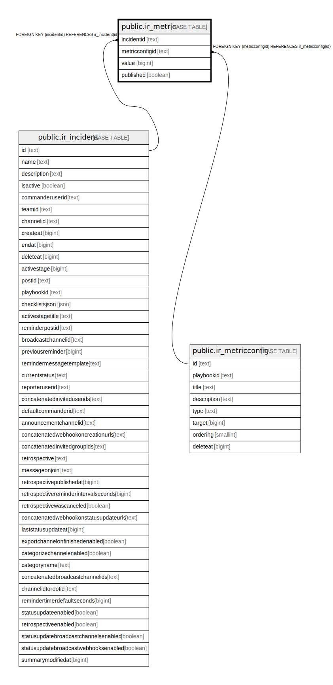

# public.ir_metric

## 概要

## カラム一覧

| 名前             | タイプ     | デフォルト値       | NULL許可   | 子テーブル      | 親テーブル                                               | コメント     |
| -------------- | ------- | ------------ | -------- | ---------- | --------------------------------------------------- | -------- |
| incidentid     | text    |              | false    |            | [public.ir_incident](public.ir_incident.md)         |          |
| metricconfigid | text    |              | false    |            | [public.ir_metricconfig](public.ir_metricconfig.md) |          |
| value          | bigint  |              | true     |            |                                                     |          |
| published      | boolean |              | false    |            |                                                     |          |

## 制約一覧

| 名前                            | タイプ         | 定義                                                          |
| ----------------------------- | ----------- | ----------------------------------------------------------- |
| ir_metric_incidentid_fkey     | FOREIGN KEY | FOREIGN KEY (incidentid) REFERENCES ir_incident(id)         |
| ir_metric_metricconfigid_fkey | FOREIGN KEY | FOREIGN KEY (metricconfigid) REFERENCES ir_metricconfig(id) |
| ir_metric_pkey                | PRIMARY KEY | PRIMARY KEY (incidentid, metricconfigid)                    |

## INDEX一覧

| 名前                       | 定義                                                                                              |
| ------------------------ | ----------------------------------------------------------------------------------------------- |
| ir_metric_pkey           | CREATE UNIQUE INDEX ir_metric_pkey ON public.ir_metric USING btree (incidentid, metricconfigid) |
| ir_metric_incidentid     | CREATE INDEX ir_metric_incidentid ON public.ir_metric USING btree (incidentid)                  |
| ir_metric_metricconfigid | CREATE INDEX ir_metric_metricconfigid ON public.ir_metric USING btree (metricconfigid)          |

## ER図

---

> Generated by [tbls](https://github.com/k1LoW/tbls)
