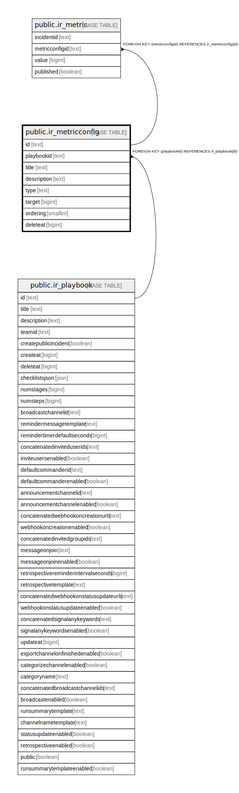

# public.ir_metricconfig

## 概要

## カラム一覧

| 名前          | タイプ      | デフォルト値       | NULL許可   | 子テーブル                                   | 親テーブル                                       | コメント     |
| ----------- | -------- | ------------ | -------- | --------------------------------------- | ------------------------------------------- | -------- |
| id          | text     |              | false    | [public.ir_metric](public.ir_metric.md) |                                             |          |
| playbookid  | text     |              | false    |                                         | [public.ir_playbook](public.ir_playbook.md) |          |
| title       | text     |              | false    |                                         |                                             |          |
| description | text     |              | false    |                                         |                                             |          |
| type        | text     |              | false    |                                         |                                             |          |
| target      | bigint   |              | true     |                                         |                                             |          |
| ordering    | smallint | 0            | false    |                                         |                                             |          |
| deleteat    | bigint   | 0            | false    |                                         |                                             |          |

## 制約一覧

| 名前                              | タイプ         | 定義                                                  |
| ------------------------------- | ----------- | --------------------------------------------------- |
| ir_metricconfig_playbookid_fkey | FOREIGN KEY | FOREIGN KEY (playbookid) REFERENCES ir_playbook(id) |
| ir_metricconfig_pkey            | PRIMARY KEY | PRIMARY KEY (id)                                    |

## INDEX一覧

| 名前                         | 定義                                                                                         |
| -------------------------- | ------------------------------------------------------------------------------------------ |
| ir_metricconfig_pkey       | CREATE UNIQUE INDEX ir_metricconfig_pkey ON public.ir_metricconfig USING btree (id)        |
| ir_metricconfig_playbookid | CREATE INDEX ir_metricconfig_playbookid ON public.ir_metricconfig USING btree (playbookid) |

## ER図

---

> Generated by [tbls](https://github.com/k1LoW/tbls)
