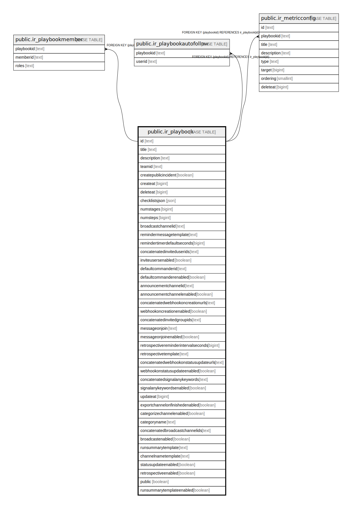

# public.ir_playbook

## 概要

## カラム一覧

| 名前                                    | タイプ     | デフォルト値       | NULL許可   | 子テーブル                                                                                                                                                                       | 親テーブル      | コメント     |
| ------------------------------------- | ------- | ------------ | -------- | --------------------------------------------------------------------------------------------------------------------------------------------------------------------------- | ---------- | -------- |
| id                                    | text    |              | false    | [public.ir_playbookmember](public.ir_playbookmember.md) [public.ir_playbookautofollow](public.ir_playbookautofollow.md) [public.ir_metricconfig](public.ir_metricconfig.md) |            |          |
| title                                 | text    |              | false    |                                                                                                                                                                             |            |          |
| description                           | text    |              | false    |                                                                                                                                                                             |            |          |
| teamid                                | text    |              | false    |                                                                                                                                                                             |            |          |
| createpublicincident                  | boolean |              | false    |                                                                                                                                                                             |            |          |
| createat                              | bigint  |              | false    |                                                                                                                                                                             |            |          |
| deleteat                              | bigint  | 0            | false    |                                                                                                                                                                             |            |          |
| checklistsjson                        | json    |              | false    |                                                                                                                                                                             |            |          |
| numstages                             | bigint  | 0            | false    |                                                                                                                                                                             |            |          |
| numsteps                              | bigint  | 0            | false    |                                                                                                                                                                             |            |          |
| broadcastchannelid                    | text    | ''::text     | true     |                                                                                                                                                                             |            |          |
| remindermessagetemplate               | text    | ''::text     | true     |                                                                                                                                                                             |            |          |
| remindertimerdefaultseconds           | bigint  | 0            | false    |                                                                                                                                                                             |            |          |
| concatenatedinviteduserids            | text    | ''::text     | true     |                                                                                                                                                                             |            |          |
| inviteusersenabled                    | boolean | false        | true     |                                                                                                                                                                             |            |          |
| defaultcommanderid                    | text    | ''::text     | true     |                                                                                                                                                                             |            |          |
| defaultcommanderenabled               | boolean | false        | true     |                                                                                                                                                                             |            |          |
| announcementchannelid                 | text    | ''::text     | true     |                                                                                                                                                                             |            |          |
| announcementchannelenabled            | boolean | false        | true     |                                                                                                                                                                             |            |          |
| concatenatedwebhookoncreationurls     | text    | ''::text     | true     |                                                                                                                                                                             |            |          |
| webhookoncreationenabled              | boolean | false        | true     |                                                                                                                                                                             |            |          |
| concatenatedinvitedgroupids           | text    | ''::text     | true     |                                                                                                                                                                             |            |          |
| messageonjoin                         | text    | ''::text     | true     |                                                                                                                                                                             |            |          |
| messageonjoinenabled                  | boolean | false        | true     |                                                                                                                                                                             |            |          |
| retrospectivereminderintervalseconds  | bigint  | 0            | false    |                                                                                                                                                                             |            |          |
| retrospectivetemplate                 | text    |              | true     |                                                                                                                                                                             |            |          |
| concatenatedwebhookonstatusupdateurls | text    | ''::text     | true     |                                                                                                                                                                             |            |          |
| webhookonstatusupdateenabled          | boolean | false        | true     |                                                                                                                                                                             |            |          |
| concatenatedsignalanykeywords         | text    | ''::text     | true     |                                                                                                                                                                             |            |          |
| signalanykeywordsenabled              | boolean | false        | true     |                                                                                                                                                                             |            |          |
| updateat                              | bigint  | 0            | false    |                                                                                                                                                                             |            |          |
| exportchannelonfinishedenabled        | boolean | false        | false    |                                                                                                                                                                             |            |          |
| categorizechannelenabled              | boolean | false        | true     |                                                                                                                                                                             |            |          |
| categoryname                          | text    | ''::text     | true     |                                                                                                                                                                             |            |          |
| concatenatedbroadcastchannelids       | text    |              | true     |                                                                                                                                                                             |            |          |
| broadcastenabled                      | boolean | false        | true     |                                                                                                                                                                             |            |          |
| runsummarytemplate                    | text    | ''::text     | true     |                                                                                                                                                                             |            |          |
| channelnametemplate                   | text    | ''::text     | true     |                                                                                                                                                                             |            |          |
| statusupdateenabled                   | boolean | true         | true     |                                                                                                                                                                             |            |          |
| retrospectiveenabled                  | boolean | true         | true     |                                                                                                                                                                             |            |          |
| public                                | boolean | false        | true     |                                                                                                                                                                             |            |          |
| runsummarytemplateenabled             | boolean | true         | true     |                                                                                                                                                                             |            |          |

## 制約一覧

| 名前               | タイプ         | 定義               |
| ---------------- | ----------- | ---------------- |
| ir_playbook_pkey | PRIMARY KEY | PRIMARY KEY (id) |

## INDEX一覧

| 名前                   | 定義                                                                             |
| -------------------- | ------------------------------------------------------------------------------ |
| ir_playbook_pkey     | CREATE UNIQUE INDEX ir_playbook_pkey ON public.ir_playbook USING btree (id)    |
| ir_playbook_teamid   | CREATE INDEX ir_playbook_teamid ON public.ir_playbook USING btree (teamid)     |
| ir_playbook_updateat | CREATE INDEX ir_playbook_updateat ON public.ir_playbook USING btree (updateat) |

## ER図

---

> Generated by [tbls](https://github.com/k1LoW/tbls)
