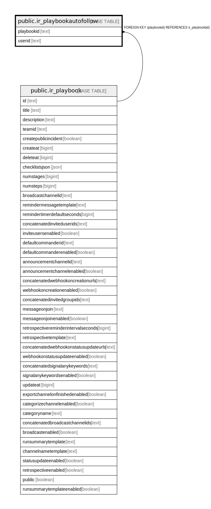

# public.ir_playbookautofollow

## 概要

## カラム一覧

| 名前         | タイプ    | デフォルト値       | NULL許可   | 子テーブル      | 親テーブル                                       | コメント     |
| ---------- | ------ | ------------ | -------- | ---------- | ------------------------------------------- | -------- |
| playbookid | text   |              | false    |            | [public.ir_playbook](public.ir_playbook.md) |          |
| userid     | text   |              | false    |            |                                             |          |

## 制約一覧

| 名前                                    | タイプ         | 定義                                                  |
| ------------------------------------- | ----------- | --------------------------------------------------- |
| ir_playbookautofollow_playbookid_fkey | FOREIGN KEY | FOREIGN KEY (playbookid) REFERENCES ir_playbook(id) |
| ir_playbookautofollow_pkey            | PRIMARY KEY | PRIMARY KEY (playbookid, userid)                    |

## INDEX一覧

| 名前                         | 定義                                                                                                              |
| -------------------------- | --------------------------------------------------------------------------------------------------------------- |
| ir_playbookautofollow_pkey | CREATE UNIQUE INDEX ir_playbookautofollow_pkey ON public.ir_playbookautofollow USING btree (playbookid, userid) |

## ER図

---

> Generated by [tbls](https://github.com/k1LoW/tbls)
