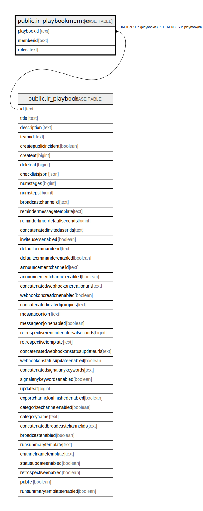

# public.ir_playbookmember

## 概要

## カラム一覧

| 名前         | タイプ    | デフォルト値       | NULL許可   | 子テーブル      | 親テーブル                                       | コメント     |
| ---------- | ------ | ------------ | -------- | ---------- | ------------------------------------------- | -------- |
| playbookid | text   |              | false    |            | [public.ir_playbook](public.ir_playbook.md) |          |
| memberid   | text   |              | false    |            |                                             |          |
| roles      | text   |              | true     |            |                                             |          |

## 制約一覧

| 名前                                        | タイプ         | 定義                                                  |
| ----------------------------------------- | ----------- | --------------------------------------------------- |
| ir_playbookmember_playbookid_fkey         | FOREIGN KEY | FOREIGN KEY (playbookid) REFERENCES ir_playbook(id) |
| ir_playbookmember_playbookid_memberid_key | UNIQUE      | UNIQUE (playbookid, memberid)                       |
| ir_playbookmember_pkey                    | PRIMARY KEY | PRIMARY KEY (memberid, playbookid)                  |

## INDEX一覧

| 名前                                        | 定義                                                                                                                           |
| ----------------------------------------- | ---------------------------------------------------------------------------------------------------------------------------- |
| ir_playbookmember_playbookid_memberid_key | CREATE UNIQUE INDEX ir_playbookmember_playbookid_memberid_key ON public.ir_playbookmember USING btree (playbookid, memberid) |
| ir_playbookmember_playbookid              | CREATE INDEX ir_playbookmember_playbookid ON public.ir_playbookmember USING btree (playbookid)                               |
| ir_playbookmember_memberid                | CREATE INDEX ir_playbookmember_memberid ON public.ir_playbookmember USING btree (memberid)                                   |
| ir_playbookmember_pkey                    | CREATE UNIQUE INDEX ir_playbookmember_pkey ON public.ir_playbookmember USING btree (memberid, playbookid)                    |

## ER図

---

> Generated by [tbls](https://github.com/k1LoW/tbls)
