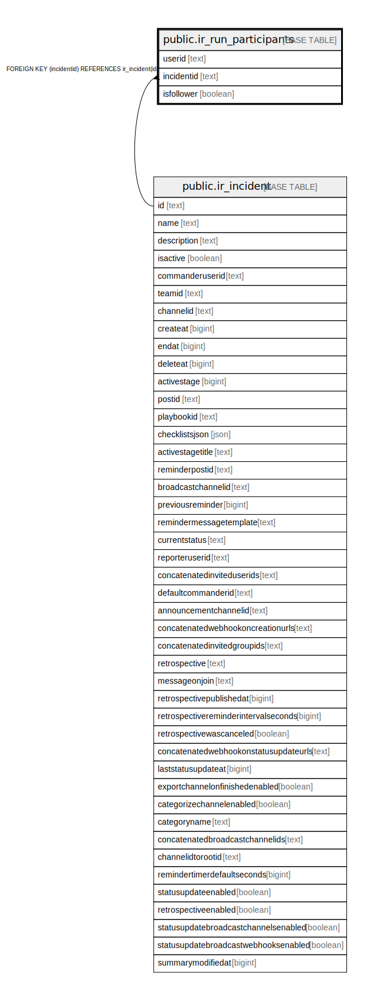

# public.ir_run_participants

## 概要

## カラム一覧

| 名前         | タイプ     | デフォルト値       | NULL許可   | 子テーブル      | 親テーブル                                       | コメント     |
| ---------- | ------- | ------------ | -------- | ---------- | ------------------------------------------- | -------- |
| userid     | text    |              | false    |            |                                             |          |
| incidentid | text    |              | false    |            | [public.ir_incident](public.ir_incident.md) |          |
| isfollower | boolean |              | false    |            |                                             |          |

## 制約一覧

| 名前                                  | タイプ         | 定義                                                  |
| ----------------------------------- | ----------- | --------------------------------------------------- |
| ir_run_participants_incidentid_fkey | FOREIGN KEY | FOREIGN KEY (incidentid) REFERENCES ir_incident(id) |
| ir_run_participants_pkey            | PRIMARY KEY | PRIMARY KEY (incidentid, userid)                    |

## INDEX一覧

| 名前                             | 定義                                                                                                          |
| ------------------------------ | ----------------------------------------------------------------------------------------------------------- |
| ir_run_participants_pkey       | CREATE UNIQUE INDEX ir_run_participants_pkey ON public.ir_run_participants USING btree (incidentid, userid) |
| ir_run_participants_userid     | CREATE INDEX ir_run_participants_userid ON public.ir_run_participants USING btree (userid)                  |
| ir_run_participants_incidentid | CREATE INDEX ir_run_participants_incidentid ON public.ir_run_participants USING btree (incidentid)          |

## ER図

---

> Generated by [tbls](https://github.com/k1LoW/tbls)
