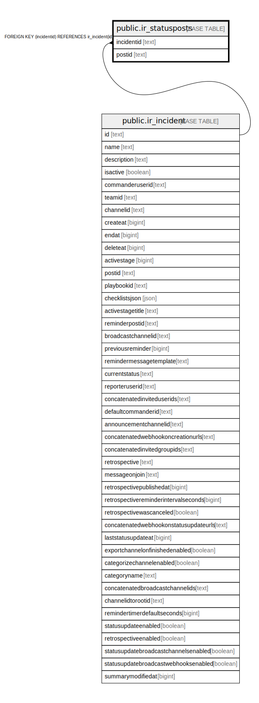

# public.ir_statusposts

## 概要

## カラム一覧

| 名前         | タイプ    | デフォルト値       | NULL許可   | 子テーブル      | 親テーブル                                       | コメント     |
| ---------- | ------ | ------------ | -------- | ---------- | ------------------------------------------- | -------- |
| incidentid | text   |              | false    |            | [public.ir_incident](public.ir_incident.md) |          |
| postid     | text   |              | false    |            |                                             |          |

## 制約一覧

| 名前                                   | タイプ         | 定義                                                  |
| ------------------------------------ | ----------- | --------------------------------------------------- |
| ir_statusposts_incidentid_fkey       | FOREIGN KEY | FOREIGN KEY (incidentid) REFERENCES ir_incident(id) |
| ir_statusposts_incidentid_postid_key | UNIQUE      | UNIQUE (incidentid, postid)                         |
| ir_statusposts_pkey                  | PRIMARY KEY | PRIMARY KEY (incidentid, postid)                    |

## INDEX一覧

| 名前                                   | 定義                                                                                                                 |
| ------------------------------------ | ------------------------------------------------------------------------------------------------------------------ |
| ir_statusposts_incidentid_postid_key | CREATE UNIQUE INDEX ir_statusposts_incidentid_postid_key ON public.ir_statusposts USING btree (incidentid, postid) |
| ir_statusposts_incidentid            | CREATE INDEX ir_statusposts_incidentid ON public.ir_statusposts USING btree (incidentid)                           |
| ir_statusposts_postid                | CREATE INDEX ir_statusposts_postid ON public.ir_statusposts USING btree (postid)                                   |
| ir_statusposts_pkey                  | CREATE UNIQUE INDEX ir_statusposts_pkey ON public.ir_statusposts USING btree (incidentid, postid)                  |

## ER図

---

> Generated by [tbls](https://github.com/k1LoW/tbls)
