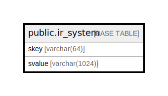

# public.ir_system

## 概要

## カラム一覧

| 名前     | タイプ           | デフォルト値       | NULL許可   | 子テーブル      | 親テーブル      | コメント     |
| ------ | ------------- | ------------ | -------- | ---------- | ---------- | -------- |
| skey   | varchar(64)   |              | false    |            |            |          |
| svalue | varchar(1024) |              | true     |            |            |          |

## 制約一覧

| 名前             | タイプ         | 定義                 |
| -------------- | ----------- | ------------------ |
| ir_system_pkey | PRIMARY KEY | PRIMARY KEY (skey) |

## INDEX一覧

| 名前             | 定義                                                                        |
| -------------- | ------------------------------------------------------------------------- |
| ir_system_pkey | CREATE UNIQUE INDEX ir_system_pkey ON public.ir_system USING btree (skey) |

## ER図

---

> Generated by [tbls](https://github.com/k1LoW/tbls)
