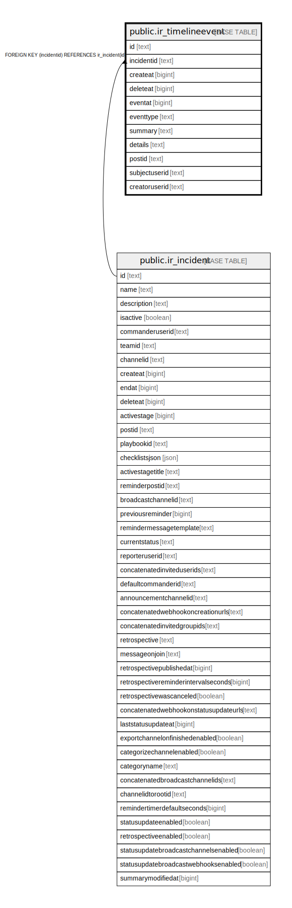

# public.ir_timelineevent

## 概要

## カラム一覧

| 名前            | タイプ    | デフォルト値       | NULL許可   | 子テーブル      | 親テーブル                                       | コメント     |
| ------------- | ------ | ------------ | -------- | ---------- | ------------------------------------------- | -------- |
| id            | text   |              | false    |            |                                             |          |
| incidentid    | text   |              | false    |            | [public.ir_incident](public.ir_incident.md) |          |
| createat      | bigint |              | false    |            |                                             |          |
| deleteat      | bigint | 0            | false    |            |                                             |          |
| eventat       | bigint |              | false    |            |                                             |          |
| eventtype     | text   | ''::text     | false    |            |                                             |          |
| summary       | text   | ''::text     | false    |            |                                             |          |
| details       | text   | ''::text     | false    |            |                                             |          |
| postid        | text   | ''::text     | false    |            |                                             |          |
| subjectuserid | text   | ''::text     | false    |            |                                             |          |
| creatoruserid | text   | ''::text     | false    |            |                                             |          |

## 制約一覧

| 名前                               | タイプ         | 定義                                                  |
| -------------------------------- | ----------- | --------------------------------------------------- |
| ir_timelineevent_incidentid_fkey | FOREIGN KEY | FOREIGN KEY (incidentid) REFERENCES ir_incident(id) |
| ir_timelineevent_pkey            | PRIMARY KEY | PRIMARY KEY (id)                                    |

## INDEX一覧

| 名前                          | 定義                                                                                           |
| --------------------------- | -------------------------------------------------------------------------------------------- |
| ir_timelineevent_id         | CREATE INDEX ir_timelineevent_id ON public.ir_timelineevent USING btree (id)                 |
| ir_timelineevent_incidentid | CREATE INDEX ir_timelineevent_incidentid ON public.ir_timelineevent USING btree (incidentid) |
| ir_timelineevent_pkey       | CREATE UNIQUE INDEX ir_timelineevent_pkey ON public.ir_timelineevent USING btree (id)        |

## ER図

---

> Generated by [tbls](https://github.com/k1LoW/tbls)
