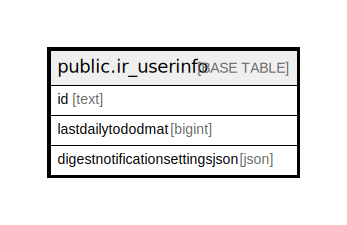

# public.ir_userinfo

## 概要

## カラム一覧

| 名前                             | タイプ    | デフォルト値       | NULL許可   | 子テーブル      | 親テーブル      | コメント     |
| ------------------------------ | ------ | ------------ | -------- | ---------- | ---------- | -------- |
| id                             | text   |              | false    |            |            |          |
| lastdailytododmat              | bigint |              | true     |            |            |          |
| digestnotificationsettingsjson | json   |              | true     |            |            |          |

## 制約一覧

| 名前               | タイプ         | 定義               |
| ---------------- | ----------- | ---------------- |
| ir_userinfo_pkey | PRIMARY KEY | PRIMARY KEY (id) |

## INDEX一覧

| 名前               | 定義                                                                          |
| ---------------- | --------------------------------------------------------------------------- |
| ir_userinfo_pkey | CREATE UNIQUE INDEX ir_userinfo_pkey ON public.ir_userinfo USING btree (id) |

## ER図

---

> Generated by [tbls](https://github.com/k1LoW/tbls)
