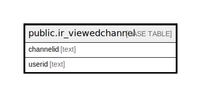

# public.ir_viewedchannel

## 概要

## カラム一覧

| 名前        | タイプ    | デフォルト値       | NULL許可   | 子テーブル      | 親テーブル      | コメント     |
| --------- | ------ | ------------ | -------- | ---------- | ---------- | -------- |
| channelid | text   |              | false    |            |            |          |
| userid    | text   |              | false    |            |            |          |

## 制約一覧

| 名前                    | タイプ         | 定義                              |
| --------------------- | ----------- | ------------------------------- |
| ir_viewedchannel_pkey | PRIMARY KEY | PRIMARY KEY (channelid, userid) |

## INDEX一覧

| 名前                    | 定義                                                                                                   |
| --------------------- | ---------------------------------------------------------------------------------------------------- |
| ir_viewedchannel_pkey | CREATE UNIQUE INDEX ir_viewedchannel_pkey ON public.ir_viewedchannel USING btree (channelid, userid) |

## ER図

---

> Generated by [tbls](https://github.com/k1LoW/tbls)
