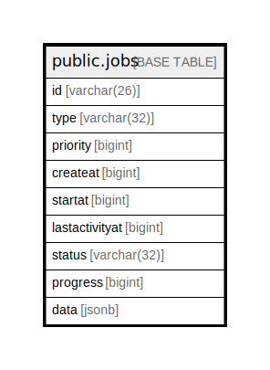

# public.jobs

## 概要

## カラム一覧

| 名前             | タイプ         | デフォルト値       | NULL許可   | 子テーブル      | 親テーブル      | コメント     |
| -------------- | ----------- | ------------ | -------- | ---------- | ---------- | -------- |
| id             | varchar(26) |              | false    |            |            |          |
| type           | varchar(32) |              | true     |            |            |          |
| priority       | bigint      |              | true     |            |            |          |
| createat       | bigint      |              | true     |            |            |          |
| startat        | bigint      |              | true     |            |            |          |
| lastactivityat | bigint      |              | true     |            |            |          |
| status         | varchar(32) |              | true     |            |            |          |
| progress       | bigint      |              | true     |            |            |          |
| data           | jsonb       |              | true     |            |            |          |

## 制約一覧

| 名前        | タイプ         | 定義               |
| --------- | ----------- | ---------------- |
| jobs_pkey | PRIMARY KEY | PRIMARY KEY (id) |

## INDEX一覧

| 名前                   | 定義                                                                          |
| -------------------- | --------------------------------------------------------------------------- |
| jobs_pkey            | CREATE UNIQUE INDEX jobs_pkey ON public.jobs USING btree (id)               |
| idx_jobs_type        | CREATE INDEX idx_jobs_type ON public.jobs USING btree (type)                |
| idx_jobs_status_type | CREATE INDEX idx_jobs_status_type ON public.jobs USING btree (status, type) |

## ER図

---

> Generated by [tbls](https://github.com/k1LoW/tbls)
