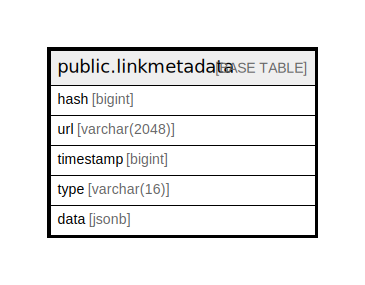

# public.linkmetadata

## 概要

## カラム一覧

| 名前        | タイプ           | デフォルト値       | NULL許可   | 子テーブル      | 親テーブル      | コメント     |
| --------- | ------------- | ------------ | -------- | ---------- | ---------- | -------- |
| hash      | bigint        |              | false    |            |            |          |
| url       | varchar(2048) |              | true     |            |            |          |
| timestamp | bigint        |              | true     |            |            |          |
| type      | varchar(16)   |              | true     |            |            |          |
| data      | jsonb         |              | true     |            |            |          |

## 制約一覧

| 名前                | タイプ         | 定義                 |
| ----------------- | ----------- | ------------------ |
| linkmetadata_pkey | PRIMARY KEY | PRIMARY KEY (hash) |

## INDEX一覧

| 名前                              | 定義                                                                                                 |
| ------------------------------- | -------------------------------------------------------------------------------------------------- |
| linkmetadata_pkey               | CREATE UNIQUE INDEX linkmetadata_pkey ON public.linkmetadata USING btree (hash)                    |
| idx_link_metadata_url_timestamp | CREATE INDEX idx_link_metadata_url_timestamp ON public.linkmetadata USING btree (url, "timestamp") |

## ER図

---

> Generated by [tbls](https://github.com/k1LoW/tbls)
