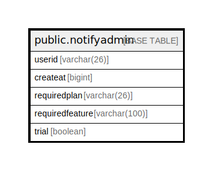

# public.notifyadmin

## 概要

## カラム一覧

| 名前              | タイプ          | デフォルト値       | NULL許可   | 子テーブル      | 親テーブル      | コメント     |
| --------------- | ------------ | ------------ | -------- | ---------- | ---------- | -------- |
| userid          | varchar(26)  |              | false    |            |            |          |
| createat        | bigint       |              | true     |            |            |          |
| requiredplan    | varchar(26)  |              | false    |            |            |          |
| requiredfeature | varchar(100) |              | false    |            |            |          |
| trial           | boolean      |              | false    |            |            |          |

## 制約一覧

| 名前               | タイプ         | 定義                                                  |
| ---------------- | ----------- | --------------------------------------------------- |
| notifyadmin_pkey | PRIMARY KEY | PRIMARY KEY (userid, requiredfeature, requiredplan) |

## INDEX一覧

| 名前               | 定義                                                                                                             |
| ---------------- | -------------------------------------------------------------------------------------------------------------- |
| notifyadmin_pkey | CREATE UNIQUE INDEX notifyadmin_pkey ON public.notifyadmin USING btree (userid, requiredfeature, requiredplan) |

## ER図

---

> Generated by [tbls](https://github.com/k1LoW/tbls)
