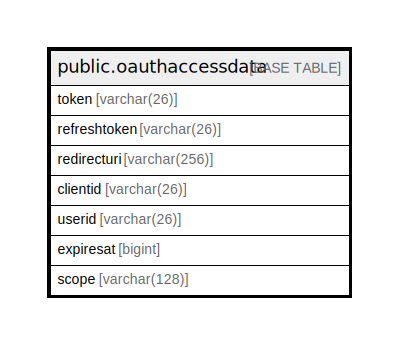

# public.oauthaccessdata

## 概要

## カラム一覧

| 名前           | タイプ          | デフォルト値       | NULL許可   | 子テーブル      | 親テーブル      | コメント     |
| ------------ | ------------ | ------------ | -------- | ---------- | ---------- | -------- |
| token        | varchar(26)  |              | false    |            |            |          |
| refreshtoken | varchar(26)  |              | true     |            |            |          |
| redirecturi  | varchar(256) |              | true     |            |            |          |
| clientid     | varchar(26)  |              | true     |            |            |          |
| userid       | varchar(26)  |              | true     |            |            |          |
| expiresat    | bigint       |              | true     |            |            |          |
| scope        | varchar(128) |              | true     |            |            |          |

## 制約一覧

| 名前                                  | タイプ         | 定義                        |
| ----------------------------------- | ----------- | ------------------------- |
| oauthaccessdata_pkey                | PRIMARY KEY | PRIMARY KEY (token)       |
| oauthaccessdata_clientid_userid_key | UNIQUE      | UNIQUE (clientid, userid) |

## INDEX一覧

| 名前                                  | 定義                                                                                                               |
| ----------------------------------- | ---------------------------------------------------------------------------------------------------------------- |
| oauthaccessdata_pkey                | CREATE UNIQUE INDEX oauthaccessdata_pkey ON public.oauthaccessdata USING btree (token)                           |
| idx_oauthaccessdata_refresh_token   | CREATE INDEX idx_oauthaccessdata_refresh_token ON public.oauthaccessdata USING btree (refreshtoken)              |
| idx_oauthaccessdata_user_id         | CREATE INDEX idx_oauthaccessdata_user_id ON public.oauthaccessdata USING btree (userid)                          |
| oauthaccessdata_clientid_userid_key | CREATE UNIQUE INDEX oauthaccessdata_clientid_userid_key ON public.oauthaccessdata USING btree (clientid, userid) |

## ER図

---

> Generated by [tbls](https://github.com/k1LoW/tbls)
