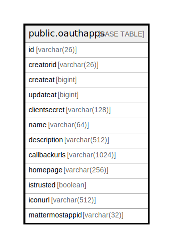

# public.oauthapps

## 概要

## カラム一覧

| 名前              | タイプ           | デフォルト値                | NULL許可   | 子テーブル      | 親テーブル      | コメント     |
| --------------- | ------------- | --------------------- | -------- | ---------- | ---------- | -------- |
| id              | varchar(26)   |                       | false    |            |            |          |
| creatorid       | varchar(26)   |                       | true     |            |            |          |
| createat        | bigint        |                       | true     |            |            |          |
| updateat        | bigint        |                       | true     |            |            |          |
| clientsecret    | varchar(128)  |                       | true     |            |            |          |
| name            | varchar(64)   |                       | true     |            |            |          |
| description     | varchar(512)  |                       | true     |            |            |          |
| callbackurls    | varchar(1024) |                       | true     |            |            |          |
| homepage        | varchar(256)  |                       | true     |            |            |          |
| istrusted       | boolean       |                       | true     |            |            |          |
| iconurl         | varchar(512)  |                       | true     |            |            |          |
| mattermostappid | varchar(32)   | ''::character varying | false    |            |            |          |

## 制約一覧

| 名前             | タイプ         | 定義               |
| -------------- | ----------- | ---------------- |
| oauthapps_pkey | PRIMARY KEY | PRIMARY KEY (id) |

## INDEX一覧

| 名前                       | 定義                                                                                |
| ------------------------ | --------------------------------------------------------------------------------- |
| oauthapps_pkey           | CREATE UNIQUE INDEX oauthapps_pkey ON public.oauthapps USING btree (id)           |
| idx_oauthapps_creator_id | CREATE INDEX idx_oauthapps_creator_id ON public.oauthapps USING btree (creatorid) |

## ER図

---

> Generated by [tbls](https://github.com/k1LoW/tbls)
