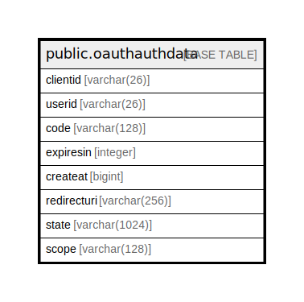

# public.oauthauthdata

## 概要

## カラム一覧

| 名前          | タイプ           | デフォルト値       | NULL許可   | 子テーブル      | 親テーブル      | コメント     |
| ----------- | ------------- | ------------ | -------- | ---------- | ---------- | -------- |
| clientid    | varchar(26)   |              | true     |            |            |          |
| userid      | varchar(26)   |              | true     |            |            |          |
| code        | varchar(128)  |              | false    |            |            |          |
| expiresin   | integer       |              | true     |            |            |          |
| createat    | bigint        |              | true     |            |            |          |
| redirecturi | varchar(256)  |              | true     |            |            |          |
| state       | varchar(1024) |              | true     |            |            |          |
| scope       | varchar(128)  |              | true     |            |            |          |

## 制約一覧

| 名前                 | タイプ         | 定義                 |
| ------------------ | ----------- | ------------------ |
| oauthauthdata_pkey | PRIMARY KEY | PRIMARY KEY (code) |

## INDEX一覧

| 名前                 | 定義                                                                                |
| ------------------ | --------------------------------------------------------------------------------- |
| oauthauthdata_pkey | CREATE UNIQUE INDEX oauthauthdata_pkey ON public.oauthauthdata USING btree (code) |

## ER図

---

> Generated by [tbls](https://github.com/k1LoW/tbls)
