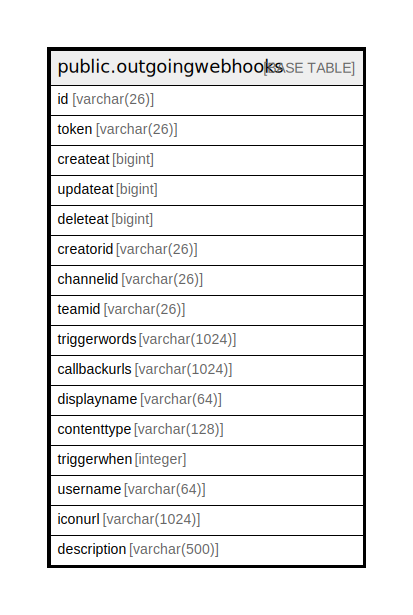

# public.outgoingwebhooks

## 概要

## カラム一覧

| 名前           | タイプ           | デフォルト値       | NULL許可   | 子テーブル      | 親テーブル      | コメント     |
| ------------ | ------------- | ------------ | -------- | ---------- | ---------- | -------- |
| id           | varchar(26)   |              | false    |            |            |          |
| token        | varchar(26)   |              | true     |            |            |          |
| createat     | bigint        |              | true     |            |            |          |
| updateat     | bigint        |              | true     |            |            |          |
| deleteat     | bigint        |              | true     |            |            |          |
| creatorid    | varchar(26)   |              | true     |            |            |          |
| channelid    | varchar(26)   |              | true     |            |            |          |
| teamid       | varchar(26)   |              | true     |            |            |          |
| triggerwords | varchar(1024) |              | true     |            |            |          |
| callbackurls | varchar(1024) |              | true     |            |            |          |
| displayname  | varchar(64)   |              | true     |            |            |          |
| contenttype  | varchar(128)  |              | true     |            |            |          |
| triggerwhen  | integer       |              | true     |            |            |          |
| username     | varchar(64)   |              | true     |            |            |          |
| iconurl      | varchar(1024) |              | true     |            |            |          |
| description  | varchar(500)  |              | true     |            |            |          |

## 制約一覧

| 名前                    | タイプ         | 定義               |
| --------------------- | ----------- | ---------------- |
| outgoingwebhooks_pkey | PRIMARY KEY | PRIMARY KEY (id) |

## INDEX一覧

| 名前                             | 定義                                                                                            |
| ------------------------------ | --------------------------------------------------------------------------------------------- |
| outgoingwebhooks_pkey          | CREATE UNIQUE INDEX outgoingwebhooks_pkey ON public.outgoingwebhooks USING btree (id)         |
| idx_outgoing_webhook_team_id   | CREATE INDEX idx_outgoing_webhook_team_id ON public.outgoingwebhooks USING btree (teamid)     |
| idx_outgoing_webhook_update_at | CREATE INDEX idx_outgoing_webhook_update_at ON public.outgoingwebhooks USING btree (updateat) |
| idx_outgoing_webhook_create_at | CREATE INDEX idx_outgoing_webhook_create_at ON public.outgoingwebhooks USING btree (createat) |
| idx_outgoing_webhook_delete_at | CREATE INDEX idx_outgoing_webhook_delete_at ON public.outgoingwebhooks USING btree (deleteat) |

## ER図

---

> Generated by [tbls](https://github.com/k1LoW/tbls)
