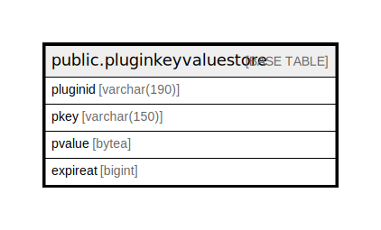

# public.pluginkeyvaluestore

## 概要

## カラム一覧

| 名前       | タイプ          | デフォルト値       | NULL許可   | 子テーブル      | 親テーブル      | コメント     |
| -------- | ------------ | ------------ | -------- | ---------- | ---------- | -------- |
| pluginid | varchar(190) |              | false    |            |            |          |
| pkey     | varchar(150) |              | false    |            |            |          |
| pvalue   | bytea        |              | true     |            |            |          |
| expireat | bigint       |              | true     |            |            |          |

## 制約一覧

| 名前                       | タイプ         | 定義                           |
| ------------------------ | ----------- | ---------------------------- |
| pluginkeyvaluestore_pkey | PRIMARY KEY | PRIMARY KEY (pluginid, pkey) |

## INDEX一覧

| 名前                       | 定義                                                                                                      |
| ------------------------ | ------------------------------------------------------------------------------------------------------- |
| pluginkeyvaluestore_pkey | CREATE UNIQUE INDEX pluginkeyvaluestore_pkey ON public.pluginkeyvaluestore USING btree (pluginid, pkey) |

## ER図

---

> Generated by [tbls](https://github.com/k1LoW/tbls)
