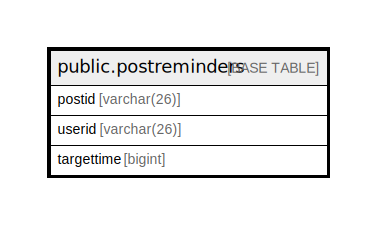

# public.postreminders

## 概要

## カラム一覧

| 名前         | タイプ         | デフォルト値       | NULL許可   | 子テーブル      | 親テーブル      | コメント     |
| ---------- | ----------- | ------------ | -------- | ---------- | ---------- | -------- |
| postid     | varchar(26) |              | false    |            |            |          |
| userid     | varchar(26) |              | false    |            |            |          |
| targettime | bigint      |              | true     |            |            |          |

## 制約一覧

| 名前                 | タイプ         | 定義                           |
| ------------------ | ----------- | ---------------------------- |
| postreminders_pkey | PRIMARY KEY | PRIMARY KEY (postid, userid) |

## INDEX一覧

| 名前                           | 定義                                                                                          |
| ---------------------------- | ------------------------------------------------------------------------------------------- |
| postreminders_pkey           | CREATE UNIQUE INDEX postreminders_pkey ON public.postreminders USING btree (postid, userid) |
| idx_postreminders_targettime | CREATE INDEX idx_postreminders_targettime ON public.postreminders USING btree (targettime)  |

## ER図

---

> Generated by [tbls](https://github.com/k1LoW/tbls)
