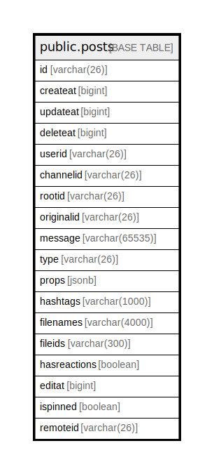

# public.posts

## 概要

## カラム一覧

| 名前           | タイプ            | デフォルト値       | NULL許可   | 子テーブル      | 親テーブル      | コメント     |
| ------------ | -------------- | ------------ | -------- | ---------- | ---------- | -------- |
| id           | varchar(26)    |              | false    |            |            |          |
| createat     | bigint         |              | true     |            |            |          |
| updateat     | bigint         |              | true     |            |            |          |
| deleteat     | bigint         |              | true     |            |            |          |
| userid       | varchar(26)    |              | true     |            |            |          |
| channelid    | varchar(26)    |              | true     |            |            |          |
| rootid       | varchar(26)    |              | true     |            |            |          |
| originalid   | varchar(26)    |              | true     |            |            |          |
| message      | varchar(65535) |              | true     |            |            |          |
| type         | varchar(26)    |              | true     |            |            |          |
| props        | jsonb          |              | true     |            |            |          |
| hashtags     | varchar(1000)  |              | true     |            |            |          |
| filenames    | varchar(4000)  |              | true     |            |            |          |
| fileids      | varchar(300)   |              | true     |            |            |          |
| hasreactions | boolean        |              | true     |            |            |          |
| editat       | bigint         |              | true     |            |            |          |
| ispinned     | boolean        |              | true     |            |            |          |
| remoteid     | varchar(26)    |              | true     |            |            |          |

## 制約一覧

| 名前         | タイプ         | 定義               |
| ---------- | ----------- | ---------------- |
| posts_pkey | PRIMARY KEY | PRIMARY KEY (id) |

## INDEX一覧

| 名前                                       | 定義                                                                                                                  |
| ---------------------------------------- | ------------------------------------------------------------------------------------------------------------------- |
| posts_pkey                               | CREATE UNIQUE INDEX posts_pkey ON public.posts USING btree (id)                                                     |
| idx_posts_update_at                      | CREATE INDEX idx_posts_update_at ON public.posts USING btree (updateat)                                             |
| idx_posts_create_at                      | CREATE INDEX idx_posts_create_at ON public.posts USING btree (createat)                                             |
| idx_posts_delete_at                      | CREATE INDEX idx_posts_delete_at ON public.posts USING btree (deleteat)                                             |
| idx_posts_user_id                        | CREATE INDEX idx_posts_user_id ON public.posts USING btree (userid)                                                 |
| idx_posts_is_pinned                      | CREATE INDEX idx_posts_is_pinned ON public.posts USING btree (ispinned)                                             |
| idx_posts_channel_id_update_at           | CREATE INDEX idx_posts_channel_id_update_at ON public.posts USING btree (channelid, updateat)                       |
| idx_posts_channel_id_delete_at_create_at | CREATE INDEX idx_posts_channel_id_delete_at_create_at ON public.posts USING btree (channelid, deleteat, createat)   |
| idx_posts_message_txt                    | CREATE INDEX idx_posts_message_txt ON public.posts USING gin (to_tsvector('english'::regconfig, (message)::text))   |
| idx_posts_hashtags_txt                   | CREATE INDEX idx_posts_hashtags_txt ON public.posts USING gin (to_tsvector('english'::regconfig, (hashtags)::text)) |
| idx_posts_root_id_delete_at              | CREATE INDEX idx_posts_root_id_delete_at ON public.posts USING btree (rootid, deleteat)                             |
| idx_posts_create_at_id                   | CREATE INDEX idx_posts_create_at_id ON public.posts USING btree (createat, id)                                      |

## ER図

---

> Generated by [tbls](https://github.com/k1LoW/tbls)
