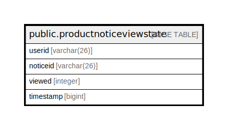

# public.productnoticeviewstate

## 概要

## カラム一覧

| 名前        | タイプ         | デフォルト値       | NULL許可   | 子テーブル      | 親テーブル      | コメント     |
| --------- | ----------- | ------------ | -------- | ---------- | ---------- | -------- |
| userid    | varchar(26) |              | false    |            |            |          |
| noticeid  | varchar(26) |              | false    |            |            |          |
| viewed    | integer     |              | true     |            |            |          |
| timestamp | bigint      |              | true     |            |            |          |

## 制約一覧

| 名前                          | タイプ         | 定義                             |
| --------------------------- | ----------- | ------------------------------ |
| productnoticeviewstate_pkey | PRIMARY KEY | PRIMARY KEY (userid, noticeid) |

## INDEX一覧

| 名前                          | 定義                                                                                                              |
| --------------------------- | --------------------------------------------------------------------------------------------------------------- |
| productnoticeviewstate_pkey | CREATE UNIQUE INDEX productnoticeviewstate_pkey ON public.productnoticeviewstate USING btree (userid, noticeid) |
| idx_notice_views_notice_id  | CREATE INDEX idx_notice_views_notice_id ON public.productnoticeviewstate USING btree (noticeid)                 |
| idx_notice_views_timestamp  | CREATE INDEX idx_notice_views_timestamp ON public.productnoticeviewstate USING btree ("timestamp")              |

## ER図

---

> Generated by [tbls](https://github.com/k1LoW/tbls)
