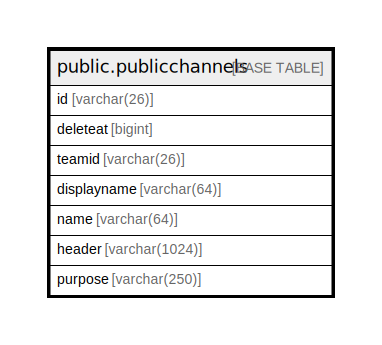

# public.publicchannels

## 概要

## カラム一覧

| 名前          | タイプ           | デフォルト値       | NULL許可   | 子テーブル      | 親テーブル      | コメント     |
| ----------- | ------------- | ------------ | -------- | ---------- | ---------- | -------- |
| id          | varchar(26)   |              | false    |            |            |          |
| deleteat    | bigint        |              | true     |            |            |          |
| teamid      | varchar(26)   |              | true     |            |            |          |
| displayname | varchar(64)   |              | true     |            |            |          |
| name        | varchar(64)   |              | true     |            |            |          |
| header      | varchar(1024) |              | true     |            |            |          |
| purpose     | varchar(250)  |              | true     |            |            |          |

## 制約一覧

| 名前                             | タイプ         | 定義                    |
| ------------------------------ | ----------- | --------------------- |
| publicchannels_pkey            | PRIMARY KEY | PRIMARY KEY (id)      |
| publicchannels_name_teamid_key | UNIQUE      | UNIQUE (name, teamid) |

## INDEX一覧

| 名前                                   | 定義                                                                                                                                                                                                          |
| ------------------------------------ | ----------------------------------------------------------------------------------------------------------------------------------------------------------------------------------------------------------- |
| publicchannels_pkey                  | CREATE UNIQUE INDEX publicchannels_pkey ON public.publicchannels USING btree (id)                                                                                                                           |
| publicchannels_name_teamid_key       | CREATE UNIQUE INDEX publicchannels_name_teamid_key ON public.publicchannels USING btree (name, teamid)                                                                                                      |
| idx_publicchannels_team_id           | CREATE INDEX idx_publicchannels_team_id ON public.publicchannels USING btree (teamid)                                                                                                                       |
| idx_publicchannels_delete_at         | CREATE INDEX idx_publicchannels_delete_at ON public.publicchannels USING btree (deleteat)                                                                                                                   |
| idx_publicchannels_name_lower        | CREATE INDEX idx_publicchannels_name_lower ON public.publicchannels USING btree (lower((name)::text))                                                                                                       |
| idx_publicchannels_displayname_lower | CREATE INDEX idx_publicchannels_displayname_lower ON public.publicchannels USING btree (lower((displayname)::text))                                                                                         |
| idx_publicchannels_search_txt        | CREATE INDEX idx_publicchannels_search_txt ON public.publicchannels USING gin (to_tsvector('english'::regconfig, (((((name)::text || ' '::text) || (displayname)::text) || ' '::text) || (purpose)::text))) |

## ER図

---

> Generated by [tbls](https://github.com/k1LoW/tbls)
